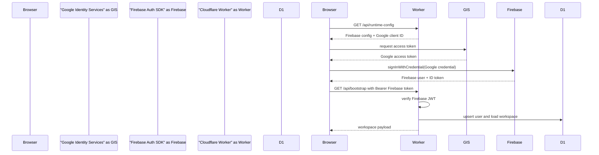
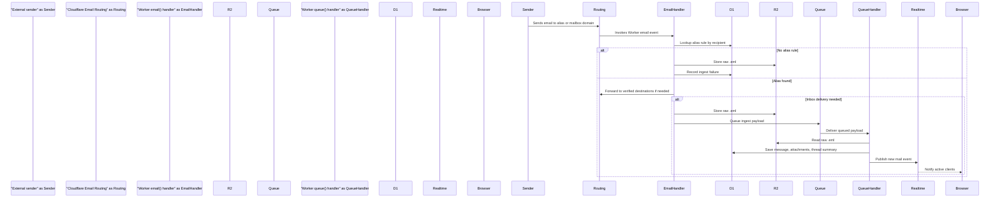
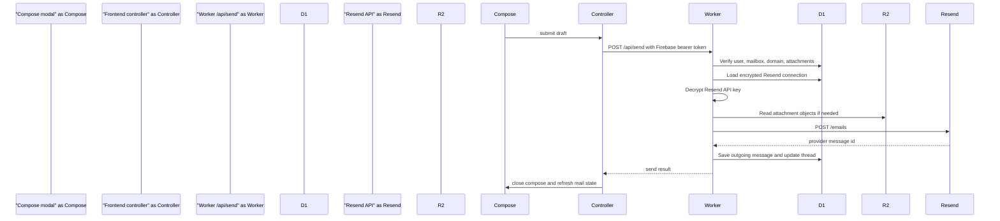

# Context For AI IDE

This file is a single-file knowledgebase for the project currently named **Email By Abhinaba Das**.

It is written for an AI IDE, an engineer, or a future maintainer who needs to understand the whole project without first reading every source file. It explains what the project does, why each service exists, how the main flows work, where the important code lives, what must be configured, and how to recreate the same system from scratch.

The older file `DescriptionOfProject[BIG].md` is a longer narrative reference. This file is optimized for fast repo context loading inside an AI coding tool.

---

## Sector 1 - Project Identity

### Product name

The user-facing product name is:

```text
Email By Abhinaba Das
```

The Cloudflare Worker name is:

```text
alias-forge-2000
```

The primary production origin is:

```text
https://email.itsabhinaba.in
```

The app is a private email workspace for one signed-in Google/Firebase user model. It is not a generic static website. It is a full-stack mail operations console built on Cloudflare Workers.

### What the app does

The application lets a signed-in user:

- sign in with Google
- connect Cloudflare API credentials
- connect Resend API credentials
- connect Gemini and Groq/Llama API credentials
- provision domains for inbound mail
- create mailboxes under those domains
- configure aliases and catch-all routing
- forward messages to verified destination addresses
- receive inbound mail through Cloudflare Email Routing
- store raw inbound mail in R2
- parse inbound mail into D1-backed threads and messages
- read inbox, sent, archive, and trash folders
- star, archive, restore, mark read, mark unread, trash, and permanently delete threads
- save drafts
- delete one draft or all drafts
- compose rich text and HTML email
- apply saved HTML templates
- save compose content as a template
- upload attachments and inline images
- send outbound mail through Resend
- generate or rewrite email content with Gemini or Llama
- view routing diagnostics, DNS hints, and ingest failures

### What the app is not

This project is not a Firebase-hosted app. Firebase is used for authentication only.

This project is not a Vercel app. Cloudflare is the canonical production host.

This project is not a normal IMAP mailbox. Mail is received by Cloudflare Email Routing, stored by the Worker, and presented through the custom React UI.

This project is not only a frontend. The Worker is responsible for API routing, auth verification, provider orchestration, email ingest, scheduled maintenance, and static asset serving.

---

## Sector 2 - Source Tree Map

Important root files:

```text
package.json                  Node scripts, dependencies, project metadata
package-lock.json             Locked dependency graph
wrangler.jsonc                Cloudflare Worker, assets, D1, R2, Queue, Durable Object, cron, route config
schema.sql                    Canonical D1 schema
index.html                    Vite HTML entry and favicon declaration
public/_headers               Static security headers for served frontend assets
public/emailsitelogo.svg      Active favicon asset
README.md                     Short human setup guide
DescriptionOfProject[BIG].md  Long existing project explanation
Context-For-AI-IDE.md         This AI IDE knowledgebase
```

Frontend source:

```text
src/main.tsx                         React root entry
src/App.tsx                          Top-level UI composition and notification mapping
src/hooks/useAppController.tsx       Main frontend controller and API state machine
src/types.ts                         Frontend types and controller contract
src/styles/global.css                Entire visual system and layout styling
src/components/AppShell.tsx          Authenticated app shell
src/components/SidebarNav.tsx        Sidebar navigation and account card
src/components/TopHeader.tsx         Page header and mail action toolbar
src/components/ThreadList.tsx        Thread list column
src/components/ThreadPreview.tsx     Mail preview pane
src/components/ComposeModal.tsx      Rich/HTML composer, AI tools, templates, autosave
src/components/StatusFooter.tsx      Bottom status bar
src/components/ActionNotifications.tsx Visible action and toast notifications
src/views/ConnectionsView.tsx        Provider credential UI
src/views/DomainsMailboxesView.tsx   Domains, mailboxes, templates, ingest failures
src/views/AliasesView.tsx            Alias and catch-all rules
src/views/DestinationsView.tsx       Forwarding destinations
src/views/DraftsView.tsx             Draft list and bulk draft deletion
```

Backend source:

```text
src/worker.js                        Cloudflare Worker entrypoint
src/lib/auth.js                      Firebase token verification
src/lib/crypto.js                    AES-GCM encryption/decryption for provider secrets
src/lib/db.js                        D1 schema migration helpers and all database operations
src/lib/http.js                      JSON responses, API errors, URL and bearer-token helpers
src/lib/mail.js                      Mail normalization, IDs, snippets, recipients, folders
src/lib/sending.js                   Sending-domain state and capability decisions
src/lib/ai.js                        AI prompt construction and response parsing
src/lib/html.ts                      HTML compose and preview sanitization helpers
src/lib/format.ts                    Frontend formatting helpers
src/lib/providers/cloudflare.js      Cloudflare API wrapper
src/lib/providers/resend.js          Resend API wrapper
src/lib/providers/gemini.js          Gemini API wrapper
src/lib/providers/groq.js            Groq/Llama API wrapper
```

Tests:

```text
tests/auth.test.js
tests/ai-assist.test.js
tests/db.test.js
tests/mail.test.js
tests/sending-domain.test.js
tests/worker.test.js
```

GitHub Actions:

```text
.github/workflows/ci.yml
.github/workflows/deploy.yml
```

---

## Sector 3 - Runtime Topology

The system is deployed as one Cloudflare Worker that also serves the frontend build from `dist`.

```mermaid
flowchart LR
  "Browser at email.itsabhinaba.in" --> "Cloudflare Worker alias-forge-2000"
  "Cloudflare Worker alias-forge-2000" --> "Static assets from dist via ASSETS binding"
  "Cloudflare Worker alias-forge-2000" --> "D1 database alias-forge-2000"
  "Cloudflare Worker alias-forge-2000" --> "R2 bucket alias-forge-mail"
  "Cloudflare Worker alias-forge-2000" --> "Cloudflare Queue alias-forge-mail-ingest"
  "Cloudflare Worker alias-forge-2000" --> "Durable Object RealtimeHub"
  "Cloudflare Worker alias-forge-2000" --> "Cloudflare API"
  "Cloudflare Worker alias-forge-2000" --> "Resend API"
  "Cloudflare Worker alias-forge-2000" --> "Gemini API"
  "Cloudflare Worker alias-forge-2000" --> "Groq API"
  "Browser at email.itsabhinaba.in" --> "Google Identity Services"
  "Browser at email.itsabhinaba.in" --> "Firebase Auth SDK"
```

The Worker has several roles:

- `fetch()` handles normal HTTP requests, API calls, static assets, public attachment URLs, runtime config, and WebSocket entry.
- `email()` handles inbound Cloudflare Email Routing events.
- `queue()` handles queued inbound mail ingest.
- `scheduled()` handles periodic reliability maintenance.
- `RealtimeHub` handles WebSocket fanout.

This means Cloudflare is not just hosting. Cloudflare is the application platform.

---

## Sector 4 - Cloudflare Configuration

The source of truth for Cloudflare deployment is `wrangler.jsonc`.

### Worker identity

```jsonc
"name": "alias-forge-2000",
"main": "src/worker.js",
"compatibility_date": "2026-04-04",
"compatibility_flags": ["nodejs_compat"]
```

The Worker script is plain JavaScript ESM, not TypeScript. The React app is TypeScript and built by Vite.

### Assets

```jsonc
"assets": {
  "directory": "./dist",
  "binding": "ASSETS"
}
```

The Worker serves frontend assets from `dist`. `npm run build` creates this directory. Requests that are not `/api/*`, realtime, public attachment paths, or Firebase compatibility paths fall through to `env.ASSETS.fetch(request)`.

### Custom domain

```jsonc
"routes": [
  {
    "pattern": "email.itsabhinaba.in",
    "custom_domain": true
  }
]
```

This means `email.itsabhinaba.in` routes directly to the Worker as a custom domain.

### D1 database

```jsonc
"d1_databases": [
  {
    "binding": "DB",
    "database_name": "alias-forge-2000",
    "database_id": "9dff9f33-59b9-40ca-a76f-0d6a09704b52"
  }
]
```

The Worker uses `env.DB` for all structured application state.

### R2 bucket

```jsonc
"r2_buckets": [
  {
    "binding": "MAIL_BUCKET",
    "bucket_name": "alias-forge-mail"
  }
]
```

The Worker uses `env.MAIL_BUCKET` for raw `.eml` files, attachments, and inline image uploads.

Raw `.eml` retention should be managed by an R2 bucket lifecycle rule. It should not be implemented by Worker code because lifecycle policy is storage infrastructure, not request logic.

### Queue

```jsonc
"queues": {
  "producers": [
    {
      "binding": "MAIL_INGEST_QUEUE",
      "queue": "alias-forge-mail-ingest"
    }
  ],
  "consumers": [
    {
      "queue": "alias-forge-mail-ingest",
      "max_batch_size": 8,
      "max_batch_timeout": 5
    }
  ]
}
```

Inbound email delivery uses the queue so the Email Worker can quickly store the raw message and defer parsing/persistence.

### Durable Object

```jsonc
"durable_objects": {
  "bindings": [
    {
      "name": "REALTIME_HUB",
      "class_name": "RealtimeHub"
    }
  ]
}
```

The Durable Object is used for realtime notifications. The frontend opens a WebSocket through `/api/realtime`.

### Cron

```jsonc
"triggers": {
  "crons": [
    "*/20 * * * *"
  ]
}
```

The scheduled handler runs every 20 minutes. It refreshes reliability state for users and queues retry work for unresolved ingest failures.

### Public vars

```jsonc
"vars": {
  "APP_NAME": "Email By Abhinaba Das",
  "PUBLIC_APP_ORIGIN": "https://email.itsabhinaba.in",
  "PUBLIC_GOOGLE_CLIENT_ID": "150955610279-rv9ukdq7ruih96q7vlqmi67uh1jsr50d.apps.googleusercontent.com"
}
```

`PUBLIC_*` values are intended to be exposed to the browser through `/api/runtime-config`.

Secrets such as `APP_ENCRYPTION_KEY`, Firebase private configuration values, and provider credentials are not placed in `wrangler.jsonc`. They are Worker secrets or encrypted per-user records.

---

## Sector 5 - Authentication Model

### Browser login

The browser uses Google Identity Services plus Firebase Auth.

The flow in `src/hooks/useAppController.tsx` is:

1. Fetch `/api/runtime-config`.
2. Initialize Firebase from runtime config or fallback config.
3. Load the Google Identity Services script.
4. Request a Google access token with the configured Google OAuth web client ID.
5. Convert the Google access token to a Firebase credential with `GoogleAuthProvider.credential(null, accessToken)`.
6. Sign into Firebase with `signInWithCredential`.
7. Listen for Firebase ID token changes through `onIdTokenChanged`.
8. Send the Firebase ID token as a bearer token to Worker APIs.

This avoids relying on Firebase Hosting helper pages as the primary login mechanism.



### Worker token verification

`src/lib/auth.js` verifies Firebase ID tokens manually in the Worker:

- reads the bearer token from the `Authorization` header
- parses the JWT
- fetches Google Secure Token JWKS from `https://www.googleapis.com/service_accounts/v1/jwk/securetoken@system.gserviceaccount.com`
- caches JWKS through Cloudflare cache and an in-memory cache
- verifies RS256 signature using `crypto.subtle`
- checks issuer, audience, subject, expiry, and not-before values
- returns the normalized profile `{ id, email, displayName, photoUrl }`

The Worker uses `upsertUser()` to make sure every authenticated Firebase user has a row in D1.

### Why Firebase is still used

Firebase remains the session authority because:

- it provides the browser SDK session state
- it produces Firebase ID tokens
- the Worker can verify those tokens without storing passwords
- user identity is stable through Firebase `user_id` or `sub`

### Critical auth settings

The Google OAuth web client must allow:

```text
https://email.itsabhinaba.in
http://localhost
http://localhost:5000
```

Firebase Auth authorized domains should include:

```text
email.itsabhinaba.in
email-maker-forge-ad61.firebaseapp.com
localhost
```

The app runtime config currently prefers the Firebase auth domain `email-maker-forge-ad61.firebaseapp.com` when the configured auth domain would equal the app host. This is done to avoid brittle helper routing on the Cloudflare custom domain.

---

## Sector 6 - Frontend Architecture

### Entry

`src/main.tsx` mounts React into `#root` and imports the global CSS.

`index.html` includes:

- viewport metadata
- Google font preconnects
- Inter and JetBrains Mono font stylesheet
- favicon at `/emailsitelogo.svg`
- Vite module script during dev, bundled assets after build

### App component

`src/App.tsx` is the top-level UI coordinator. It does not own most business logic. It:

- calls `useAppController()`
- maps controller status strings into active notifications and toasts
- renders boot screen while `booting` is true
- renders login screen when no user is available
- renders `AppShell` after sign-in
- switches between mail view and admin/config views
- mounts `ComposeModal`

Status classification in `App.tsx` is important. The controller sets plain status messages like `Sending...`, `Draft saved.`, or `Delete failed`. `App.tsx` decides whether that message becomes:

- an active in-progress notice
- a success toast
- a warning toast
- an error toast
- a status clear

### Controller

`src/hooks/useAppController.tsx` is the main frontend brain.

It owns:

- runtime config
- Firebase auth references
- current user
- boot/login status
- current view
- current folder
- selected mailbox filter
- search query
- workspace data
- zones
- threads
- selected thread
- compose seed
- alert counts
- folder counts
- mailbox unread counts
- pagination cursors
- sending-domain state
- realtime connection state

The controller exposes a large `AppController` object typed in `src/types.ts`. Components call controller methods instead of touching the API directly.

Important controller methods:

```text
signInWithGoogle
signOut
refreshCurrentView
switchView
openMailboxInbox
selectThread
openCompose
openReply
openForward
archiveSelected
restoreSelected
trashSelected
starSelected
markReadSelected
markUnreadSelected
emptyTrash
saveConnection
provisionDomain
refreshDomain
selectSendingDomain
repairDomainRouting
saveMailbox
deleteMailbox
saveTemplate
deleteTemplate
saveAliasRule
deleteAliasRule
saveForwardDestination
deleteDraft
deleteAllDrafts
retryIngestFailure
loadMoreThreads
loadMoreDrafts
loadMoreAliases
loadMoreForwardDestinations
loadMoreHtmlTemplates
loadMoreMailboxes
loadMoreIngestFailures
saveComposeDraft
uploadComposeAttachments
runComposeAiAction
sendCompose
downloadAttachment
```

### Layout

`AppShell` creates the authenticated application frame:

- `SidebarNav` on the left
- `TopHeader` above content
- active view body in the center
- `StatusFooter` at the bottom

The mail view uses a two-pane workspace:

- `ThreadList`
- `ThreadPreview`

Admin views use the same shell but render configuration surfaces.

### Navigation groups

The sidebar groups are defined in `src/lib/constants.ts`:

```text
Mail:
  Inbox
  Sent
  Drafts
  Archive
  Trash

Workspace:
  Connections
  Forwarding

Domains:
  Domains & Mailboxes
  Aliases & Routing
```

The sidebar also lists individual mailboxes and shows unread counts from backend summary data.

---

## Sector 7 - Compose System

`src/components/ComposeModal.tsx` is one of the most complex frontend files.

It supports:

- selecting the sending mailbox
- entering To, Cc, Bcc, and subject
- rich text editing
- HTML email editing
- visual HTML editing
- split visual/source mode
- source-only mode
- template picker
- applying templates into compose
- saving compose content as an HTML template
- AI provider selection
- Gemini model selection
- Llama fixed model display
- tone presets
- AI prompt input
- actions such as compose, rewrite, shorten, expand, formalize, casualize, proofread, summarize
- text selection replacement
- attachment uploads
- inline image paste/drop
- signature insertion
- draft autosave
- manual draft save
- send

### Compose draft shape

The `ComposeDraft` type includes:

```text
id
domainId
mailboxId
threadId
fromAddress
to
cc
bcc
subject
textBody
htmlBody
attachments
editorMode
aiProvider
aiModel
aiTone
aiPrompt
templateId
```

### Rich mode

Rich mode uses a `contentEditable` container. It serializes editor content into `htmlBody` and derives `textBody` by stripping HTML.

Formatting uses `document.execCommand` for common operations:

- bold
- italic
- underline
- unordered list
- ordered list
- quote
- link
- signature insertion

### HTML mode

HTML mode uses three panel modes:

```text
visual
split
source
```

The visual pane sanitizes HTML into a safe editable body plus preserved style markup. The source pane is a textarea. `serializeVisualHtml()` recombines styles and edited body into a complete HTML document.

### Inline images

Image paste/drop behavior:

1. Collect image files from clipboard or drag event.
2. Upload files through the existing upload API.
3. Filter uploaded attachments to images.
4. Insert `` markup with the uploaded public URL into the active rich, visual, or source editor.

This uses hosted R2 URLs rather than CID attachments.

### Autosave

Compose computes a draft snapshot from meaningful fields. It avoids saving empty unsent drafts with no ID. It queues saves so concurrent autosave requests do not corrupt local state.

The UI exposes a compose sync pill with states like:

```text
Autosave is ready.
Unsaved changes.
Saving draft...
Draft saved.
Draft save failed.
```

### Save as template

The composer can save the current body into `html_templates` by calling the controller `saveTemplate()` method. The user is prompted for a template name. Existing template selection can update the current template.

---

## Sector 8 - Backend Request Flow

The Worker request entrypoint is `export default.fetch` in `src/worker.js`.

High-level logic:

1. Parse request URL.
2. Handle `/__/firebase/init.json` compatibility response.
3. Optionally proxy Firebase helper paths for compatibility.
4. Handle CORS preflight for API requests.
5. Reject disallowed origins.
6. Serve `/api/runtime-config` publicly.
7. Serve public attachment and inline image URLs.
8. Upgrade `/api/realtime` to WebSocket.
9. Serve static assets for non-API requests.
10. For API requests, verify Firebase bearer token.
11. Upsert user.
12. Dispatch API route.
13. Wrap errors into JSON API errors.

```mermaid
flowchart TD
  "HTTP request" --> "Parse URL"
  "Parse URL" --> "Runtime config path?"
  "Runtime config path?" -->|"yes"| "Return public runtime config"
  "Runtime config path?" -->|"no"| "Public attachment or inline image?"
  "Public attachment or inline image?" -->|"yes"| "Validate signed URL and stream R2 object"
  "Public attachment or inline image?" -->|"no"| "Realtime WebSocket?"
  "Realtime WebSocket?" -->|"yes"| "Verify token and connect Durable Object"
  "Realtime WebSocket?" -->|"no"| "API path?"
  "API path?" -->|"no"| "Serve Vite asset from ASSETS binding"
  "API path?" -->|"yes"| "Verify Firebase bearer token"
  "Verify Firebase bearer token" --> "Upsert user in D1"
  "Upsert user in D1" --> "Dispatch /api route"
  "Dispatch /api route" --> "Return JSON response"
```

### Public routes

These routes do not require the normal authenticated app context:

```text
GET /api/runtime-config
GET /api/public/attachments
GET /api/public/inline-image
GET /__/firebase/init.json
GET/POST /__/auth/* compatibility proxy paths
```

Attachment and inline image routes still rely on signed URL parameters.

### Authenticated API routes

Authenticated routes are under `/api/*` and require a Firebase bearer token unless explicitly public.

Core route groups:

```text
GET  /api/bootstrap
GET  /api/session
GET  /api/realtime
GET  /api/cloudflare/zones
POST /api/providers/cloudflare
POST /api/providers/resend
POST /api/providers/gemini
POST /api/providers/groq
GET  /api/domains
POST /api/domains
POST /api/domains/:id/refresh
POST /api/domains/:id/repair-routing
POST /api/domains/:id/select-sending
GET  /api/mailboxes
POST /api/mailboxes
PATCH/PUT /api/mailboxes/:id
DELETE /api/mailboxes/:id
GET  /api/html-templates
POST /api/html-templates
PATCH/PUT /api/html-templates/:id
DELETE /api/html-templates/:id
GET  /api/forward-destinations
POST /api/forward-destinations
GET  /api/aliases
POST /api/aliases
PATCH/PUT /api/aliases/:id
DELETE /api/aliases/:id
GET  /api/threads
GET  /api/threads/:id
POST /api/threads/actions
POST /api/threads/:id/actions
GET  /api/drafts
POST /api/drafts
DELETE /api/drafts/:id
GET  /api/ingest-failures
POST /api/ingest-failures/:id/retry
POST /api/uploads
POST /api/send
POST /api/ai/assist
GET  /api/attachments/:id
```

The exact path parsing is implemented in `src/worker.js`. Some route groups support pagination by returning `{ items, nextCursor }`.

---

## Sector 9 - Bootstrap

`bootstrapData()` in `src/worker.js` loads the initial workspace payload after login.

It loads:

- user
- provider connections
- domains
- first page of mailboxes
- alert counts
- folder counts
- mailbox unread counts
- provider secret state for Cloudflare, Resend, Gemini, and Groq
- alias rules
- hydrated domain diagnostics
- selected sending domain
- sending status message

The frontend calls `/api/bootstrap` during boot and after important workspace changes.

Current behavior detail: domain hydration can call live Cloudflare and Resend diagnostics via `collectDomainDiagnostics()`. If provider APIs are slow, bootstrap can become slow. This matters because the frontend boot request timeout is `BOOT_REQUEST_TIMEOUT_MS = 10000`.

Operational implication:

- Keep Cloudflare and Resend credentials valid.
- Keep provider APIs responsive.
- Consider moving live diagnostics out of bootstrap if login-time timeouts return.

---

## Sector 10 - Database Model

The canonical schema is `schema.sql`. `src/lib/db.js` also contains schema migration/compatibility helpers.

### Table overview

```text
users
provider_connections
domains
mailboxes
forward_destinations
alias_rules
threads
messages
attachments
drafts
html_templates
ingest_failures
```

### users

Stores authenticated Firebase users.

Important fields:

```text
id                         Firebase user id
email                      User email
display_name               Google display name
photo_url                  Google profile image
selected_sending_domain_id Preferred domain for outbound sending
created_at
updated_at
```

### provider_connections

Stores per-user provider credentials. Secrets are encrypted before storage.

Important fields:

```text
provider                   cloudflare, resend, gemini, groq
label                      UI label
secret_ciphertext          AES-GCM encrypted secret
metadata_json              Provider-specific metadata
status                     connected, reconnect_required, etc.
```

The encryption key is `APP_ENCRYPTION_KEY`. If this key changes, existing encrypted provider secrets cannot be decrypted and must be re-saved.

### domains

Stores managed domains.

Important fields:

```text
zone_id                    Cloudflare zone id
account_id                 Cloudflare account id
hostname                   Domain name
resend_domain_id           Linked Resend domain id
resend_status              Resend verification/sending state
send_capability            send_enabled, receive_only, send_unavailable
routing_status             pending, enabled, degraded, etc.
routing_error              Last routing error
routing_checked_at         Last diagnostic timestamp
catch_all_mode             inbox_only, forward_only, inbox_and_forward
catch_all_mailbox_id       Mailbox used for catch-all inbox delivery
catch_all_forward_json     Forward destinations for catch-all
ingest_destination_id      Cloudflare Email Routing destination id
```

Only the selected sending domain should become send-enabled. Other provisioned domains are receive-only.

### mailboxes

Stores named inbox/sender identities under a domain.

Important fields:

```text
domain_id
local_part
email_address
display_name
signature_html
signature_text
is_default_sender
```

Example:

```text
local_part = admin
hostname = itsabhinaba.in
email_address = admin@itsabhinaba.in
```

### forward_destinations

Stores external addresses that can receive forwarded mail.

Important fields:

```text
email
display_name
cloudflare_destination_id
verification_state
```

Cloudflare requires forwarding destination addresses to be verified before use.

### alias_rules

Stores routing rules for inbound addresses and catch-all behavior.

Important fields:

```text
domain_id
mailbox_id
local_part
is_catch_all
mode
ingress_address
forward_destination_json
cloudflare_rule_id
enabled
```

`mode` controls delivery:

```text
inbox_only
forward_only
inbox_and_forward
```

`ingress_address` is an internal address used by Cloudflare Email Routing to deliver to the Worker.

### threads

Stores conversation-level summaries.

Important fields:

```text
folder
subject
subject_normalized
participants_json
snippet
latest_message_at
message_count
unread_count
starred
```

Folders include:

```text
inbox
sent
archive
trash
```

### messages

Stores individual inbound and outbound messages.

Important fields:

```text
thread_id
direction
folder
internet_message_id
provider_message_id
from_json
to_json
cc_json
bcc_json
subject
text_body
html_body
raw_r2_key
references_json
in_reply_to
is_read
starred
has_attachments
sent_at
received_at
```

Raw message content lives in R2; D1 stores the parsed, searchable, displayable metadata and bodies.

### attachments

Stores metadata for R2-backed files.

Important fields:

```text
message_id
draft_id
file_name
mime_type
byte_size
content_id
disposition
r2_key
```

Attachment bytes are stored in R2.

### drafts

Stores saved compose state.

Important fields:

```text
domain_id
mailbox_id
thread_id
from_address
to_json
cc_json
bcc_json
subject
text_body
html_body
attachment_json
```

Draft attachments are stored as JSON metadata in `attachment_json`.

### html_templates

Stores reusable HTML email templates.

Important fields:

```text
domain_id
name
subject
html_content
```

Templates can be domain-specific or available to any sending domain.

### ingest_failures

Stores inbound delivery failures that need diagnostics or retry.

Important fields:

```text
recipient
message_id
raw_r2_key
reason
payload_json
first_seen_at
last_seen_at
retry_count
resolved_at
```

Common reason:

```text
alias_not_found
```

---

## Sector 11 - Inbound Mail Flow

Inbound mail is handled by Cloudflare Email Routing.



### Email handler

`src/worker.js` `email(message, env, ctx)`:

1. Ensures schema.
2. Looks up alias rule by recipient.
3. If missing, stores raw email in R2 and records an ingest failure.
4. If the rule forwards, forwards to verified destination addresses.
5. If the rule is `forward_only`, stops after forwarding.
6. Otherwise stores raw email in R2.
7. Sends a queue payload to `MAIL_INGEST_QUEUE`.

### Queue handler

`src/worker.js` `queue(batch, env)`:

1. Ensures schema.
2. Processes each queued message with `queueIngest()`.
3. Acknowledges each message.

Queue ingest parses raw mail using `postal-mime`, creates or updates a thread, saves a message, extracts attachments, stores attachments in R2, updates thread summaries, resolves matching ingest failures, and publishes realtime events.

---

## Sector 12 - Outbound Mail Flow

Outbound sending uses Resend.



Rules:

- Sending requires Resend connection.
- Sending requires a selected send-enabled domain.
- Sending requires a mailbox from the selected sending domain.
- Receive-only domains cannot send.
- Attachments have size limits in the Worker.

Current constants in `src/worker.js`:

```text
MAX_ATTACHMENT_BYTES = 20 MB
MAX_TOTAL_ATTACHMENT_BYTES = 35 MB
PUBLIC_ATTACHMENT_TTL_SECONDS = 300
```

---

## Sector 13 - Domain, Routing, and Sending Logic

The app treats receiving and sending as separate capabilities.

Receiving uses:

- Cloudflare zone
- Cloudflare Email Routing
- Email Routing rules
- catch-all routing
- Worker email handler

Sending uses:

- Resend connection
- Resend domain
- selected sending domain
- Resend DNS verification
- mailbox under the selected sending domain

`src/lib/sending.js` defines send capability:

```text
send_enabled
receive_only
send_unavailable
```

The selected sending domain is stored on the user record as `selected_sending_domain_id`. `deriveSendingDomainPlan()` marks the selected domain as send-enabled if Resend is connected, and all other domains as receive-only.

### Domain provisioning

When provisioning a domain, the app expects:

- Cloudflare API token to be connected
- Resend API key to be connected if outbound sending is desired
- a Cloudflare zone selected from `/api/cloudflare/zones`
- a default mailbox local part, usually `admin`

The Worker coordinates:

- D1 domain creation
- default mailbox creation
- Cloudflare Email Routing setup
- Cloudflare destination address setup
- catch-all and/or rule setup
- Resend domain creation or status linking
- sending capability update

### Routing diagnostics

Domain diagnostics include:

```text
emailWorkerBound
mxStatus
catchAllStatus
catchAllPreview
routingRuleStatus
routingReady
dnsIssues
resendDnsRecords
resendDnsStatus
lastRoutingCheckAt
diagnosticError
```

The Domains view surfaces this information inline.

---

## Sector 14 - Provider Credentials and Encryption

Provider credentials are saved through the Connections view and stored in `provider_connections`.

Providers:

```text
cloudflare
resend
gemini
groq
```

`src/lib/crypto.js` implements encryption with AES-GCM:

1. Derive a 32-byte key from `APP_ENCRYPTION_KEY`.
2. Generate a random 12-byte IV for each encryption.
3. Encrypt plaintext provider secret.
4. Store ciphertext as:

```text
base64(iv).base64(payload)
```

If `APP_ENCRYPTION_KEY` changes, old provider secrets fail to decrypt. The app marks affected connections as `reconnect_required`, and users must re-save those API keys.

Provider secret values are masked for display using `maskSecret()`.

### Provider validation

When saving a provider:

- Cloudflare token is verified with `/user/tokens/verify`.
- Resend API key is verified by listing domains.
- Gemini key is verified by listing models.
- Groq key is verified by listing models.

---

## Sector 15 - AI Composition

AI composition is split between frontend UI and Worker provider calls.

Frontend:

- user selects provider, model/tone, and action
- user can select text in editor
- user enters an AI prompt
- controller calls `/api/ai/assist`

Backend:

- `src/lib/ai.js` builds a strict prompt
- `src/worker.js` loads and decrypts provider key
- Gemini calls `generateGeminiContent()`
- Groq calls `generateGroqChat()`
- response is parsed by `parseAiAssistResult()`

Actions:

```text
compose
rewrite
shorten
expand
formalize
casualize
proofread
summarize
```

Tone presets:

```text
professional
friendly
formal
concise
persuasive
empathetic
confident
upbeat
```

For HTML email output, the system prompt demands:

- email-safe HTML
- inline styles
- table-based structure where appropriate
- visual hierarchy
- spacing
- CTA where appropriate
- responsive max-width behavior
- JSON-only output

Gemini supports structured JSON response first and falls back to plain text generation if JSON mode fails. Groq uses OpenAI-compatible chat completions.

---

## Sector 16 - HTML Preview and Safety

HTML preview and compose helpers live in `src/lib/html.ts`.

Important functions:

```text
stripHtmlToText
textToComposeHtml
sanitizeEmailPreviewFragment
buildEmailPreviewDocument
appendSignatureToDocument
serializeVisualHtml
```

Sanitization removes:

```text
script
iframe
object
embed
form
input
button
textarea
select
inline event handlers
javascript: href/src/action values
```

Thread HTML preview uses a sandboxed iframe:

```tsx
sandbox="allow-popups allow-popups-to-escape-sandbox"
```

The preview document injects CSS that tries to make common fixed-width email markup fill the preview pane:

- root/body width `100%`
- tables max-width `100%`
- images max-width `100%`
- no large centered side margins
- wrapped pre/code/block content

This is intentionally optimized for readable in-app preview, not pixel-perfect email-client simulation.

---

## Sector 17 - Realtime

Realtime is handled by the `RealtimeHub` Durable Object in `src/worker.js`.

Flow:

```mermaid
flowchart LR
  "Browser" --> "GET /api/realtime?token=FirebaseIDToken"
  "Worker" --> "Verify token"
  "Worker" --> "Durable Object RealtimeHub /connect"
  "Worker queue ingest" --> "Durable Object RealtimeHub /publish"
  "RealtimeHub" --> "Connected browser sockets"
```

The frontend controller:

- obtains a fresh Firebase token
- opens WebSocket to `/api/realtime`
- tracks `idle`, `connecting`, `connected`, `reconnecting`
- reacts to realtime events by refreshing relevant data

The footer shows realtime state.

---

## Sector 18 - Pagination

The backend supports cursor pagination for several data sets. The frontend stores cursors in `CursorState`.

Cursor fields:

```text
threads
drafts
aliases
forwardDestinations
htmlTemplates
mailboxes
ingestFailures
```

Frontend load-more methods:

```text
loadMoreThreads
loadMoreDrafts
loadMoreAliases
loadMoreForwardDestinations
loadMoreHtmlTemplates
loadMoreMailboxes
loadMoreIngestFailures
```

Backend functions in `src/lib/db.js` include:

```text
listThreadsPage
listDraftsPage
listAliasRulesPage
listForwardDestinationsPage
listHtmlTemplatesPage
listMailboxesPage
listIngestFailuresPage
```

The common wire shape is:

```json
{
  "items": [],
  "nextCursor": "..."
}
```

---

## Sector 19 - Security Model

Security layers:

1. Browser login through Google and Firebase.
2. Worker-side Firebase JWT verification.
3. User-scoped database queries.
4. Encrypted provider credentials.
5. CORS origin checks.
6. CSP and static headers.
7. Signed attachment URLs.
8. Sandboxed HTML email preview.
9. Attachment size limits.

### CORS

Default allowed origins in `src/worker.js` include:

```text
http://localhost:5173
http://127.0.0.1:5173
http://localhost:8787
http://127.0.0.1:8787
https://email.itsabhinaba.in
https://emailbye075.vercel.app
https://emailmakerbye075.vercel.app
```

The environment variable `ALLOWED_ORIGINS` can override or extend deployment behavior.

### CSP

`public/_headers` defines a Content Security Policy for static frontend responses.

Important allowances:

- scripts from self, Firebase/Google static hosts, and Google accounts
- images from self, data, blob, and HTTPS
- connections to self, HTTPS, and WSS
- frames for Google accounts and Firebase auth domains

### Attachments

Attachments are retrieved through authenticated APIs or signed public URLs. Signed public URLs are short-lived and are intended for preview/download use.

---

## Sector 20 - Local Development

Install dependencies:

```powershell
npm install
```

Copy environment example:

```powershell
Copy-Item .dev.vars.example .dev.vars
```

Fill `.dev.vars` with:

```text
FIREBASE_PROJECT_ID
FIREBASE_API_KEY
FIREBASE_AUTH_DOMAIN
FIREBASE_APP_ID
FIREBASE_MESSAGING_SENDER_ID
PUBLIC_GOOGLE_CLIENT_ID
ALLOWED_ORIGINS
APP_ENCRYPTION_KEY
```

Run Vite frontend:

```powershell
npm run dev
```

Run Worker locally:

```powershell
npm run dev:worker
```

Build frontend:

```powershell
npm run build
```

Deploy:

```powershell
npm run deploy
```

Apply D1 schema remotely:

```powershell
npx wrangler d1 execute alias-forge-2000 --remote --file schema.sql
```

Set encryption secret:

```powershell
npx wrangler secret put APP_ENCRYPTION_KEY
```

Run checks:

```powershell
npm run typecheck
npm test
npm run build
npx wrangler deploy --dry-run
```

---

## Sector 21 - GitHub CI and Deploy

Pull requests run `.github/workflows/ci.yml`.

CI steps:

```text
checkout
setup Node 22
npm ci
node --check src/worker.js src/lib/db.js src/lib/auth.js
npm run typecheck
npm run build
npm test
node --test tests/db.test.js tests/worker.test.js
npx wrangler deploy --dry-run
```

Pushes to `main` run `.github/workflows/deploy.yml`.

Deploy steps:

```text
checkout
setup Node 22
npm ci
npm run typecheck
npm test
npm run build
cloudflare/wrangler-action@v3 command: deploy
```

Required GitHub secrets:

```text
CLOUDFLARE_API_TOKEN
CLOUDFLARE_ACCOUNT_ID
```

The Cloudflare API token must be able to deploy Workers and access the linked resources.

---

## Sector 22 - Recreating This Project From Scratch

This is the minimum conceptual rebuild path.

### 1. Create the frontend

Use Vite with React and TypeScript.

Install runtime dependencies:

```powershell
npm install react react-dom firebase framer-motion lucide-react postal-mime
```

Install dev dependencies:

```powershell
npm install -D typescript vite @vitejs/plugin-react wrangler @types/react @types/react-dom
```

Create:

```text
index.html
src/main.tsx
src/App.tsx
src/styles/global.css
src/types.ts
src/hooks/useAppController.tsx
src/components/*
src/views/*
```

The frontend should never store provider secrets directly. It only sends them to Worker APIs for encryption and storage.

### 2. Create Firebase project

In Firebase/Google Cloud:

1. Create a Firebase project.
2. Enable Authentication.
3. Enable Google provider.
4. Create or use a web app.
5. Copy Firebase web config.
6. Create/use a Google OAuth web client ID.
7. Add authorized JavaScript origins.
8. Add Firebase authorized domains.

The browser receives public Firebase config from `/api/runtime-config`.

### 3. Create Cloudflare resources

Create:

```text
Worker alias-forge-2000
D1 database alias-forge-2000
R2 bucket alias-forge-mail
Queue alias-forge-mail-ingest
Durable Object class RealtimeHub
Custom domain email.itsabhinaba.in
```

Configure all bindings in `wrangler.jsonc`.

### 4. Create D1 schema

Use `schema.sql` as the database schema and apply it to D1.

### 5. Implement Worker

Worker must include:

- static asset serving
- runtime config endpoint
- CORS and CSP handling
- Firebase JWT verification
- provider connection APIs
- D1 CRUD APIs
- Cloudflare Email Routing orchestration
- Resend outbound sending
- Gemini/Groq AI route
- R2 attachment upload/download
- Email Worker handler
- Queue consumer
- Cron handler
- Durable Object class

### 6. Configure Cloudflare Email Routing

For each domain:

1. Add domain to Cloudflare DNS/zone.
2. Enable Email Routing.
3. Verify MX records point to Cloudflare Email Routing.
4. Create or repair routing rules.
5. Ensure routes target the Worker destination.
6. Configure catch-all as desired.
7. Verify forwarding destinations if forwarding is used.

### 7. Configure Resend

1. Add Resend API key in the Connections UI.
2. Create/link Resend domain.
3. Add DNS records required by Resend.
4. Wait for verification.
5. Select that domain as sending domain.
6. Use a mailbox under that domain for outbound compose.

### 8. Configure AI providers

Add API keys through the Connections UI:

```text
Gemini API key
Groq API key
```

Gemini models supported by UI:

```text
gemini-2.5-flash
gemini-2.0-flash
gemini-2.0-flash-lite
```

Groq/Llama model:

```text
llama-3.3-70b-versatile
```

### 9. Deploy

Build and deploy:

```powershell
npm run build
npx wrangler deploy
```

For automatic deploys, push to `main` after configuring GitHub secrets.

---

## Sector 23 - Common Failure Modes

### Firebase `auth/internal-error`

Likely causes:

- Firebase helper flow was being used accidentally.
- Auth domain mismatch.
- OAuth client ID mismatch.
- Google OAuth web client missing authorized origin.
- Runtime config serving wrong Firebase or Google config.

Current architecture uses Google Identity Services token popup plus Firebase credential exchange to reduce helper-domain dependence.

### Google `invalid_client`

Likely causes:

- `PUBLIC_GOOGLE_CLIENT_ID` is wrong.
- OAuth client was deleted.
- wrong Google Cloud project.
- OAuth client is not a web client.

### Bootstrap timeout

Likely causes:

- `/api/bootstrap` is waiting on provider diagnostics.
- Cloudflare API is slow.
- Resend API is slow.
- Provider encrypted secret cannot decrypt cleanly.
- D1 or Worker cold path is slow.

Important current code point:

```text
src/worker.js -> bootstrapData()
```

### Provider decrypt failure

Likely cause:

- `APP_ENCRYPTION_KEY` changed after provider secrets were saved.

Fix:

- re-save provider connections in the Connections UI.

### Origin not allowed

Likely cause:

- request origin is not in allowed origins.
- `ALLOWED_ORIGINS` missing production origin.
- old Vercel origin still calling Worker.

Fix:

- include `https://email.itsabhinaba.in` in allowed origins.

### Mail not appearing

Likely causes:

- Email Routing MX not configured.
- Cloudflare Email Routing disabled.
- alias rule missing.
- catch-all not pointing where expected.
- queue failed.
- raw message recorded as ingest failure.

Check:

- Domains diagnostics
- Aliases view
- Ingest failures
- Worker logs
- R2 raw message keys

### HTML email does not look identical to source service

Reasons:

- email HTML is often copied without its full CSS/runtime context
- scripts and forms are stripped
- external platform CSS may not be included
- preview injects responsive CSS to fit the app pane
- real email-client support is much narrower than a website/browser preview

This app favors safe, readable, responsive mail preview over exact website embedding.

---

## Sector 24 - Development Rules For Future AI Agents

When editing this project:

1. Treat `src/hooks/useAppController.tsx` as the frontend state owner.
2. Treat `src/worker.js` as the backend route and event owner.
3. Treat `src/lib/db.js` and `schema.sql` as the data model source of truth.
4. Do not put provider API keys in frontend code.
5. Do not make Firebase the deployment target.
6. Do not reintroduce Vercel as an app proxy.
7. Do not change `APP_ENCRYPTION_KEY` casually.
8. Do not put raw email bytes into D1.
9. Do not bypass user scoping in DB queries.
10. Do not render untrusted HTML directly in the parent React document.
11. Do not remove queue-based ingest unless replacing it with an equally safe async path.
12. Do not make Cloudflare/Resend live diagnostics block core UI interactions without timeout handling.
13. Prefer adding tests when modifying `src/lib/db.js`, auth, sending, queue ingest, or Worker routes.
14. Run `npm run typecheck`, `npm test`, and `npm run build` before pushing code changes.

### Good files to inspect first by task

For login bugs:

```text
src/hooks/useAppController.tsx
src/lib/auth.js
src/worker.js runtime config and API auth paths
wrangler.jsonc vars
```

For mail receiving bugs:

```text
src/worker.js email() and queue()
src/lib/db.js saveInboundMessage and ingest failure functions
src/lib/mail.js
schema.sql
```

For sending bugs:

```text
src/components/ComposeModal.tsx
src/hooks/useAppController.tsx sendCompose()
src/worker.js handleSend()
src/lib/providers/resend.js
src/lib/sending.js
```

For domain/routing bugs:

```text
src/views/DomainsMailboxesView.tsx
src/worker.js handleDomains()
src/lib/providers/cloudflare.js
src/lib/providers/resend.js
src/lib/sending.js
```

For UI layout bugs:

```text
src/styles/global.css
src/components/AppShell.tsx
src/components/SidebarNav.tsx
src/components/ThreadList.tsx
src/components/ThreadPreview.tsx
src/components/TopHeader.tsx
```

For compose/editor bugs:

```text
src/components/ComposeModal.tsx
src/lib/html.ts
src/hooks/useAppController.tsx
src/lib/ai.js
```

---

## Sector 25 - Quick Mental Model

The whole project can be reduced to this:

```mermaid
flowchart TD
  "User signs in with Google" --> "Firebase issues ID token"
  "Firebase issues ID token" --> "Browser calls Worker APIs"
  "Browser calls Worker APIs" --> "Worker verifies Firebase token"
  "Worker verifies Firebase token" --> "D1 user-scoped app data"
  "Cloudflare Email Routing receives mail" --> "Worker email event"
  "Worker email event" --> "R2 raw .eml storage"
  "R2 raw .eml storage" --> "Queue ingest"
  "Queue ingest" --> "D1 threads and messages"
  "D1 threads and messages" --> "React inbox UI"
  "React compose UI" --> "Worker send API"
  "Worker send API" --> "Resend outbound email"
  "Cloudflare API" --> "Domain routing setup"
  "Gemini and Groq" --> "AI compose assistance"
```

If an AI IDE needs to make a change, it should first identify which side of this graph the change belongs to:

- authentication
- frontend state
- mail ingest
- message storage
- outbound sending
- domain orchestration
- AI generation
- UI layout
- deployment/configuration

That classification usually points directly to the right files.

