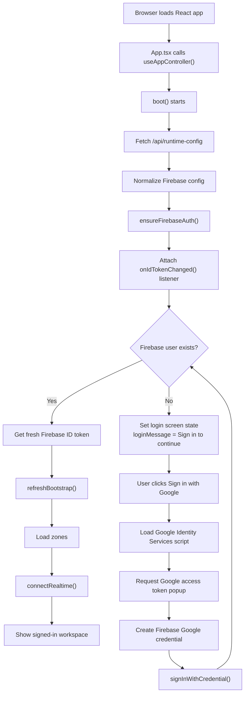
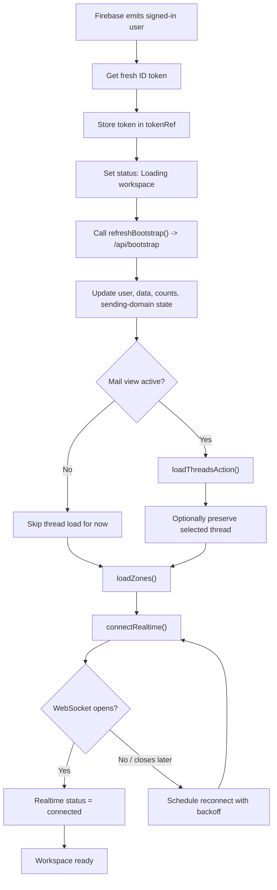
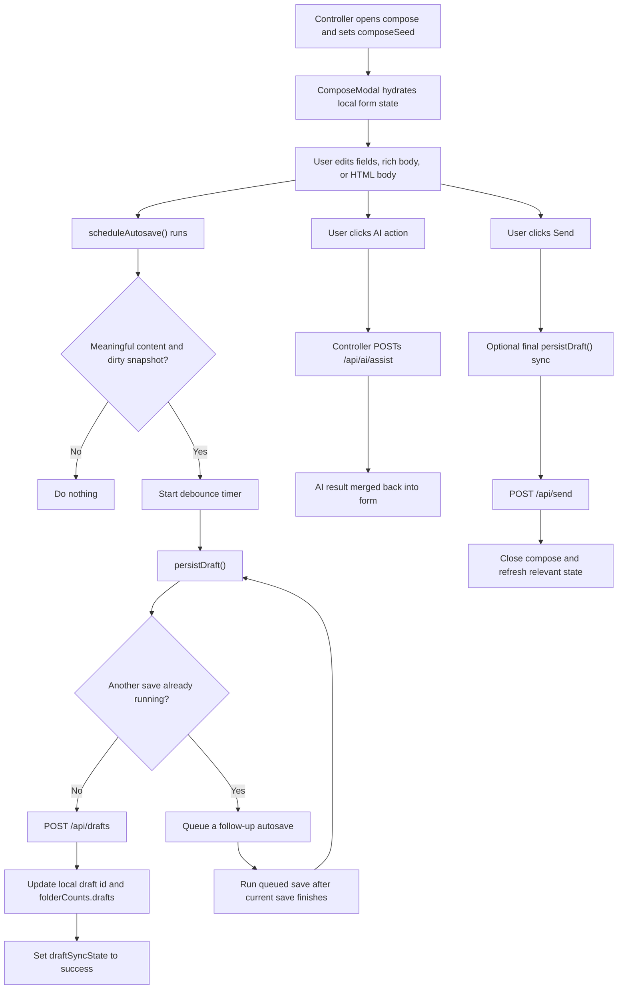

# DescriptionOfProject[BIG]

This document is intentionally written in parts so it can grow without turning into an unreadable dump.

It is also intended to function as a standalone project knowledgebase.

That means the document is not written only for a human reading the source code side-by-side. It is being written so that a future engineer, reviewer, operator, or even an external AI system with access only to this file can still reconstruct how the project works, what services it depends on, and where the important implementation logic lives.

The goal of this file is simple:

1. Explain what this project is.
2. Explain how it is deployed and what external services it depends on.
3. Explain where the important logic lives in the codebase.
4. Explain the data model and request flow in a way that a new engineer can follow.
5. Serve as a durable project map for future maintenance.
6. Act as a knowledge transfer artifact that can stand in for direct source-code familiarity.

This is **Part 1**, focused on the system overview, runtime topology, configuration, deployment, and top-level module structure.

---

## 1. What This Project Is

`Email By Abhinaba Das` is a full-stack email workspace built on **Cloudflare Workers**.

At a high level, it gives a signed-in user a single interface for:

- receiving mail for custom domains
- creating inboxes and mailboxes
- managing aliases and catch-all routing
- forwarding mail to destination addresses
- reading stored inbound mail
- composing outbound mail
- saving drafts
- saving reusable HTML templates
- generating or rewriting content with AI providers

This is not a simple static dashboard. It is a complete hosted application made of:

- a **React + TypeScript frontend**
- a **Cloudflare Worker backend**
- **D1** for relational application data
- **R2** for raw message and attachment storage
- **Cloudflare Queues** for mail ingest processing
- a **Durable Object** for realtime state / live updates
- **Firebase** for browser authentication
- **Cloudflare Email Routing** for inbound domain routing
- **Resend** for outbound email sending
- **Gemini** and **Groq/Llama** for AI-assisted composition

Primary references:

- `package.json`
- `wrangler.jsonc`
- `README.md`
- `src/worker.js`
- `src/App.tsx`
- `src/hooks/useAppController.tsx`
- `schema.sql`

---

## 2. Product Intent

The project is trying to behave like a private email operations console rather than a generic consumer mailbox.

The user experience revolves around these capabilities:

- connect infrastructure providers once
- provision a sending/receiving domain
- create mailboxes under that domain
- route inbound mail into the application
- inspect and manage the resulting threads
- forward selected traffic elsewhere
- compose and send branded or templated HTML mail
- use AI to draft or rewrite email content

This explains why the application mixes several concerns in one place:

- mailbox operations
- routing management
- domain verification
- credential storage
- content generation
- outbound delivery

The backend is therefore both:

- an application API
- and an orchestration layer across external providers

---

## 3. Runtime Topology

The production runtime is centered on a single Cloudflare Worker:

- Worker name: `alias-forge-2000`
- primary custom domain: `https://email.itsabhinaba.in`
- fallback Workers.dev domain: `https://alias-forge-2000.abhinaba.workers.dev`

Source reference:

- `wrangler.jsonc`

The Worker performs several jobs at once:

- serves the frontend assets from `dist`
- exposes the JSON API under `/api/*`
- verifies Firebase identity tokens
- stores and retrieves mail data from D1/R2
- processes inbound email events
- manages provider integrations
- signs temporary attachment URLs
- handles scheduled maintenance
- coordinates realtime client updates through a Durable Object

This design matters because it means the app is not split into separate frontend hosting and backend hosting systems. The Worker is the entire application boundary.

---

## 4. Main External Services and Why They Exist

### 4.1 Cloudflare Workers

Cloudflare Workers is the primary execution environment.

It is used for:

- request routing
- API endpoints
- asset serving
- auth token verification
- mail ingest
- provider orchestration
- scheduled jobs

The main backend entrypoint is:

- `src/worker.js`

### 4.2 Cloudflare D1

D1 is the application database.

It stores structured records such as:

- users
- provider connections
- domains
- mailboxes
- forward destinations
- alias rules
- threads
- messages
- attachments
- drafts
- HTML templates
- ingest failures

Bindings reference:

- `wrangler.jsonc` -> `d1_databases`
- `schema.sql`
- `src/lib/db.js`

### 4.3 Cloudflare R2

R2 is the object storage layer.

It stores binary or raw content that does not belong directly in D1 rows, especially:

- raw inbound `.eml` files
- uploaded attachments
- inline images and message-related binary assets

Bindings reference:

- `wrangler.jsonc` -> `r2_buckets`
- `src/worker.js`

### 4.4 Cloudflare Queues

Queues decouple inbound email ingestion from final persistence.

This gives the app a safer asynchronous path for:

- receiving raw mail events
- parsing them
- matching aliases
- deciding mailbox delivery or forwarding
- storing the final thread/message records

Bindings reference:

- `wrangler.jsonc` -> `queues`
- `src/worker.js`

### 4.5 Durable Objects

The app uses a Durable Object named `RealtimeHub`.

Its purpose is realtime coordination. In practice this is used so the frontend can reflect updates without a full page refresh, especially after:

- new mail arrival
- thread updates
- workspace bootstrap changes

Bindings reference:

- `wrangler.jsonc` -> `durable_objects`
- `src/worker.js`

### 4.6 Firebase Authentication

Firebase is used as the identity provider and token issuer for browser login.

Important boundary:

- Firebase is **not** the deployment target
- Firebase is **not** the data store
- Firebase is used for **authentication only**

The browser signs in through Google and receives a Firebase-authenticated session. The frontend then sends the Firebase ID token to the Worker, and the Worker verifies that token itself.

Code references:

- `src/hooks/useAppController.tsx`
- `src/lib/auth.js`
- `.dev.vars.example`
- `src/lib/constants.ts`

### 4.7 Cloudflare Email Routing

Cloudflare Email Routing is the inbound mail system for managed domains.

It is used for:

- enabling mail handling for a domain
- creating destination addresses
- creating alias / catch-all routing rules
- routing traffic into the Email Worker

Provider integration reference:

- `src/lib/providers/cloudflare.js`

### 4.8 Resend

Resend is the outbound email provider.

It is used for:

- domain-level sending status
- domain verification
- actual outbound message submission

Provider integration reference:

- `src/lib/providers/resend.js`
- `src/lib/sending.js`

### 4.9 AI Providers

The app supports at least two AI backends:

- Google Gemini
- Groq-hosted Llama

They are used for:

- AI compose
- rewrite
- shorten
- expand
- formalize
- casualize
- proofread
- summarize

References:

- `src/lib/ai.js`
- `src/lib/providers/gemini.js`
- `src/lib/providers/groq.js`

---

## 5. Deployment Configuration

The authoritative deployment configuration is `wrangler.jsonc`.

Key fields and what they mean:

### 5.1 Worker identity

```json
"name": "alias-forge-2000"
```

This is the Worker name used in Cloudflare.

### 5.2 Main entrypoint

```json
"main": "src/worker.js"
```

This tells Wrangler that the server runtime starts in `src/worker.js`.

### 5.3 Worker assets

```json
"assets": {
  "directory": "./dist",
  "binding": "ASSETS"
}
```

This means the React frontend is built by Vite into `dist`, then served by the Worker via the `ASSETS` binding.

This is an important architectural detail:

- Vite builds the frontend
- Wrangler deploys the frontend as Worker assets
- Cloudflare serves both UI and API

### 5.4 Custom domain

```json
"routes": [
  {
    "pattern": "email.itsabhinaba.in",
    "custom_domain": true
  }
]
```

This makes the custom domain point directly to the Worker.

### 5.5 D1 binding

```json
"d1_databases": [
  {
    "binding": "DB",
    "database_name": "alias-forge-2000",
    "database_id": "9dff9f33-59b9-40ca-a76f-0d6a09704b52"
  }
]
```

The Worker code can refer to `env.DB` to read and write the application database.

### 5.6 R2 binding

```json
"r2_buckets": [
  {
    "binding": "MAIL_BUCKET",
    "bucket_name": "alias-forge-mail"
  }
]
```

The Worker code can refer to `env.MAIL_BUCKET` for object storage.

### 5.7 Queue binding

```json
"queues": {
  "producers": [
    {
      "binding": "MAIL_INGEST_QUEUE",
      "queue": "alias-forge-mail-ingest"
    }
  ],
  "consumers": [
    {
      "queue": "alias-forge-mail-ingest",
      "max_batch_size": 8,
      "max_batch_timeout": 5
    }
  ]
}
```

This tells the Worker two things:

- it can enqueue mail ingest tasks through `env.MAIL_INGEST_QUEUE`
- it also consumes that queue as a worker consumer

### 5.8 Durable Object binding

```json
"durable_objects": {
  "bindings": [
    {
      "name": "REALTIME_HUB",
      "class_name": "RealtimeHub"
    }
  ]
}
```

This provides realtime synchronization support to the app.

### 5.9 Scheduled trigger

```json
"triggers": {
  "crons": [
    "*/20 * * * *"
  ]
}
```

The Worker has a scheduled job that runs every 20 minutes.

This is used for background maintenance such as:

- provider synchronization
- ingest failure retry work

### 5.10 Public environment variables

```json
"vars": {
  "APP_NAME": "Email By Abhinaba Das",
  "PUBLIC_APP_ORIGIN": "https://email.itsabhinaba.in",
  "PUBLIC_GOOGLE_CLIENT_ID": "150955610279-rv9ukdq7ruih96q7vlqmi67uh1jsr50d.apps.googleusercontent.com"
}
```

These are not secrets. They are runtime configuration values intentionally available to the Worker or the frontend runtime config endpoint.

---

## 6. Local Development Configuration

The local development example file is:

- `.dev.vars.example`

It documents the important non-checked-in runtime values:

- `FIREBASE_PROJECT_ID`
- `FIREBASE_API_KEY`
- `FIREBASE_AUTH_DOMAIN`
- `FIREBASE_APP_ID`
- `FIREBASE_MESSAGING_SENDER_ID`
- `PUBLIC_GOOGLE_CLIENT_ID`
- `ALLOWED_ORIGINS`
- `APP_ENCRYPTION_KEY`

Important distinction:

- values prefixed with `PUBLIC_` are expected to be visible to the frontend runtime config
- values like `APP_ENCRYPTION_KEY` are server-side operational secrets

This project also depends on Cloudflare resource bindings which are **not** represented in `.dev.vars.example`, because those come from `wrangler.jsonc`.

---

## 7. Frontend Architecture

The frontend is a Vite-built React application.

Minimal entry chain:

- `index.html`
- `src/main.tsx`
- `src/App.tsx`

### 7.1 `src/main.tsx`

This is the browser bootstrap file.

Responsibilities:

- import React
- import the global CSS
- mount the React application into `#root`

This file is intentionally thin.

### 7.2 `src/App.tsx`

This is the UI shell coordinator.

It decides which major surface to render based on controller state:

- boot screen
- login screen
- signed-in application shell
- compose modal
- action notifications

Core observations:

- all meaningful state comes from `useAppController()`
- the UI is status-driven
- the app has one persistent controller, many render surfaces

Main render branches:

- booting -> show boot splash
- no user -> show login
- authenticated -> show `AppShell` and active workspace view

### 7.3 `src/hooks/useAppController.tsx`

This is the single most important frontend file.

It is the client-side application controller.

It manages:

- runtime config boot
- Firebase initialization
- Google sign-in flow
- token refresh
- API calls
- workspace bootstrap loading
- thread selection and pagination
- compose state launching
- domain and provider actions
- realtime connection state
- action status messages

In other words, this hook is the bridge between:

- browser UI components
- Firebase auth
- Worker JSON APIs
- realtime messaging

If a future engineer wants to understand the frontend’s behavior, this is the first serious file to read.

---

## 8. Backend Architecture

The Worker backend is concentrated in `src/worker.js`.

This file is large because it acts as the application’s unified server.

Its responsibilities include:

- runtime config delivery
- CORS handling
- security headers
- Firebase helper compatibility endpoints
- authenticated API routing
- attachment signing
- inline image serving
- database-backed workspace bootstrap
- inbound mail ingest
- provider orchestration
- scheduled maintenance
- realtime support

The architecture inside `src/worker.js` can be thought of as several layers:

### 8.1 Runtime/config layer

Examples:

- `resolveApiBaseUrl()`
- `buildRuntimeConfig()`
- `buildFirebaseInitConfig()`

These functions produce the frontend-facing configuration that the React app downloads at startup.

### 8.2 Security / request envelope layer

Examples:

- `createCorsHeaders()`
- `withCors()`
- `withSecurityHeaders()`
- signed attachment helpers

These functions enforce the boundary around the application.

### 8.3 Authenticated context layer

Examples:

- `getAuthenticatedContext()`
- `getRealtimeContext()`

These use the Firebase ID token to identify the current user and create a durable app-level user record.

### 8.4 Provider orchestration layer

Examples:

- Cloudflare routing provisioning
- Resend send capability status
- AI provider validation and usage

### 8.5 Data / application layer

Examples:

- bootstrap payload generation
- thread and draft actions
- domain and mailbox persistence
- ingest failure tracking

### 8.6 Event / maintenance layer

Examples:

- queue consumer handling
- scheduled retries / sync work

---

## 9. Security Model at a High Level

The security model is straightforward but important:

1. The browser authenticates with Google/Firebase.
2. Firebase provides an ID token.
3. The browser sends that token in the `Authorization` header.
4. The Worker verifies the Firebase signature and claims.
5. The Worker maps the Firebase identity to an app `users` row.
6. Every protected query is scoped through that user.

Relevant references:

- `src/lib/auth.js`
- `src/worker.js`

Additional protection layers exist for files:

- public attachment URLs are short-lived
- signatures are HMAC-based
- payloads include user identity and attachment identity

That logic lives in:

- `src/worker.js`

---

## 10. Directory Map

This is the practical “where do I look?” map for the repository.

### Root-level files

- `package.json`  
  Tooling, dependencies, scripts.

- `wrangler.jsonc`  
  Worker deployment, bindings, custom domain, cron, D1/R2/Queue/DO resources.

- `schema.sql`  
  Authoritative D1 schema definition.

- `.dev.vars.example`  
  Local environment variable template.

- `README.md`  
  Operational setup summary.

### Frontend

- `src/main.tsx`  
  React bootstrap.

- `src/App.tsx`  
  Top-level app rendering and notification orchestration.

- `src/hooks/useAppController.tsx`  
  Main client-side controller and runtime bridge.

- `src/components/*`  
  Shared UI primitives and app shell surfaces.

- `src/views/*`  
  Page-level workspace views such as domains, aliases, destinations, and drafts.

- `src/styles/global.css`  
  Global UI styling for the application.

### Backend

- `src/worker.js`  
  Main Worker entrypoint and API router.

- `src/lib/auth.js`  
  Firebase token verification.

- `src/lib/db.js`  
  D1 read/write logic and query helpers.

- `src/lib/providers/cloudflare.js`  
  Cloudflare Email Routing provider calls.

- `src/lib/providers/resend.js`  
  Resend integration.

- `src/lib/providers/gemini.js`  
  Gemini integration.

- `src/lib/providers/groq.js`  
  Groq/Llama integration.

- `src/lib/ai.js`  
  AI request building and response normalization.

- `src/lib/sending.js`  
  Sending domain eligibility and sending-state logic.

### Tests and CI

- `tests/*`  
  Focused Node test coverage for auth, database behavior, worker behavior, sending logic, and AI utilities.

- `.github/workflows/ci.yml`  
  Pull request validation.

- `.github/workflows/deploy.yml`  
  Auto-deploy to Cloudflare on `main`.

---

## 11. How To Read This Project As A New Engineer

A practical reading order for someone new:

1. `README.md`
2. `wrangler.jsonc`
3. `schema.sql`
4. `src/worker.js`
5. `src/lib/auth.js`
6. `src/lib/db.js`
7. `src/hooks/useAppController.tsx`
8. `src/App.tsx`
9. `src/views/*`
10. `tests/*`

Why this order works:

- first understand deployment
- then understand storage
- then understand server routing and auth
- then understand frontend orchestration
- then read the actual UI surfaces

---

## 12. What This Document Will Cover Next

The next parts should cover:

- Part 2: detailed database schema and each table’s role
- Part 3: request/response flow and API route map
- Part 4: mail ingest flow from inbound message to stored thread
- Part 5: outbound sending flow and sending-domain logic
- Part 6: frontend view-by-view explanation
- Part 7: AI provider flow, prompt shaping, and compose behavior
- Part 8: deployment, secrets, CI/CD, operations, and maintenance notes

This file is intentionally growing in stages so the explanation remains accurate and reviewable.

---

## Part 2: Database Schema and Data Model

Part 2 explains the D1 schema in detail.

The database is the canonical state of the product. Even though Cloudflare, Firebase, Resend, and R2 all participate in the system, D1 is the place where the application decides:

- who the user is inside the app
- which providers are connected
- which domains are managed
- where mail should go
- how threads and messages are organized
- what drafts and templates exist
- which failures still need repair or retry

Authoritative references for this section:

- `schema.sql`
- `src/lib/db.js`
- `src/lib/mail.js`

---

## 13. Database Philosophy

The schema is intentionally application-centric.

That means external provider data is not treated as the final truth. Instead, provider state is imported, normalized, and persisted into the app’s own model.

Examples:

- a Cloudflare routing rule becomes an `alias_rules` row plus a stored external `cloudflare_rule_id`
- a Resend domain becomes a `domains` row with `resend_domain_id`, `resend_status`, and `send_capability`
- an inbound raw email becomes a `messages` row plus an R2 object key

This pattern makes the system more maintainable because the frontend can render from one database model instead of hitting every provider directly.

---

## 14. Schema Conventions

Several conventions appear throughout the schema.

### 14.1 Every major entity has a text primary key

Examples:

- `usr_...`
- `dom_...`
- `drf_...`
- `tpl_...`

The code typically uses `createId()` from `src/lib/mail.js` to generate these.

### 14.2 Most rows are user-scoped

Almost every major table contains `user_id`.

This is the security boundary inside the app. Even if two users both connect Cloudflare or Resend, their domains, mailboxes, drafts, and messages remain isolated by user-scoped queries.

### 14.3 Timestamps are stored as integers

The schema generally stores timestamps as integer epoch values in milliseconds.

Examples:

- `created_at`
- `updated_at`
- `routing_checked_at`
- `first_seen_at`
- `last_seen_at`
- `resolved_at`

### 14.4 Some fields are JSON blobs

The app deliberately uses JSON columns in D1 where nested list-like structures are practical.

Examples:

- `metadata_json`
- `participants_json`
- `to_json`
- `cc_json`
- `bcc_json`
- `references_json`
- `attachment_json`
- `payload_json`

In `src/lib/db.js`, `JSON_FIELDS` defines which columns must be parsed and serialized automatically.

This matters because D1 stores them as text, but the application expects arrays or objects at runtime.

### 14.5 Foreign keys are used, but not everywhere

The schema enables `PRAGMA foreign_keys = ON`.

This provides relational integrity for many important links:

- user -> domain
- domain -> mailbox
- thread -> message
- message -> attachment

At the same time, some external-provider identifiers remain plain scalar fields because they represent remote system state rather than internal relational entities.

---

## 15. Table-by-Table Explanation

This section covers each table, what it means, and how it is used.

---

## 16. `users`

Schema:

- `id`
- `email`
- `display_name`
- `photo_url`
- `selected_sending_domain_id`
- `created_at`
- `updated_at`

Purpose:

This is the app’s internal user table.

Even though authentication comes from Firebase, the application still needs its own row so it can attach app state to a stable user identity.

Important behavior:

- `id` matches the Firebase user identity that the Worker verifies
- `selected_sending_domain_id` stores the user’s preferred sending domain for compose and outbound mail
- `photo_url` is used for the signed-in avatar in the UI

Main DB functions:

- `upsertUser()`
- `getUser()`
- `updateUserSelectedSendingDomain()`

Why this table exists:

Without it, the app would have to compute user state only from provider data or session claims. That would make preferences, domain selection, and UI personalization harder to persist.

---

## 17. `provider_connections`

Schema:

- `id`
- `user_id`
- `provider`
- `label`
- `secret_ciphertext`
- `metadata_json`
- `status`
- `created_at`
- `updated_at`

Purpose:

This table stores connected providers per user.

Examples of `provider` values in the codebase:

- `cloudflare`
- `resend`
- `gemini`
- `groq`

Important fields:

- `secret_ciphertext` contains encrypted provider credentials
- `metadata_json` stores provider-specific non-secret metadata
- `status` tracks whether the connection is usable

Security note:

Secrets are not stored in plaintext. They are encrypted through logic in:

- `src/lib/crypto.js`

Important constraint:

```sql
UNIQUE(user_id, provider)
```

This means one user gets one active connection record per provider type.

Main DB functions:

- `listConnections()`
- `getConnection()`
- `saveConnection()`

Why this table exists:

The application needs to store provider credentials per signed-in user so domain provisioning, routing management, sending, and AI generation can happen in the context of that user’s account.

---

## 18. `domains`

Schema:

- `id`
- `user_id`
- `zone_id`
- `account_id`
- `hostname`
- `label`
- `resend_domain_id`
- `resend_status`
- `send_capability`
- `routing_status`
- `routing_error`
- `routing_checked_at`
- `catch_all_mode`
- `catch_all_mailbox_id`
- `catch_all_forward_json`
- `ingest_destination_id`
- `created_at`
- `updated_at`

Purpose:

This is one of the most central tables in the entire product.

A `domains` row represents a user-managed email domain inside the app.

Key concepts encoded here:

- Cloudflare zone identity
- sending capability through Resend
- inbound routing health
- catch-all behavior
- routing destination state

Important fields:

### `zone_id` and `account_id`

These tie the row back to Cloudflare.

### `hostname`

The actual domain name, for example `pay.itsabhinaba.in`.

### `resend_domain_id`

The external identifier returned by Resend for sending-domain management.

### `resend_status`

Tracks the domain’s sending/verification state from Resend.

### `send_capability`

Normalized application-level sending state.

The DB helper layer explicitly normalizes this through `normalizeSendCapability()`.

Known values:

- `send_enabled`
- `receive_only`
- `send_unavailable`

### `routing_status`

Tracks inbound mail readiness.

Examples:

- `pending`
- `enabled`
- `degraded`

### `routing_error`

Human-readable routing failure text when the domain is not healthy.

### `catch_all_mode`

Controls what happens to mail that does not match a more specific alias rule.

### `catch_all_mailbox_id`

If the catch-all delivers into a mailbox, this links the domain to that mailbox.

### `catch_all_forward_json`

If the catch-all forwards instead of or in addition to inbox delivery, this field stores the selected destination identifiers.

### `ingest_destination_id`

Used to remember the Cloudflare email routing destination that points back into the Worker.

Main DB functions:

- `listDomains()`
- `getDomain()`
- `createDomain()`
- `updateDomain()`

Key helper behavior:

- `decorateDomain()` enriches rows with:
  - `sendCapability`
  - `canSend`
  - normalized routing fields

Why this table exists:

It is the bridge between provider-level domain state and the app’s user-facing operational model.

---

## 19. `mailboxes`

Schema:

- `id`
- `user_id`
- `domain_id`
- `local_part`
- `email_address`
- `display_name`
- `signature_html`
- `signature_text`
- `is_default_sender`
- `created_at`
- `updated_at`

Purpose:

A mailbox is a concrete inbox/sender identity under a domain.

Examples:

- `admin@itsabhinaba.in`
- `e075@itsabhinaba.in`

Important fields:

### `local_part`

The mailbox name before `@`.

### `email_address`

The fully materialized address.

### `signature_html` and `signature_text`

Per-mailbox signature content used during compose.

### `is_default_sender`

Indicates which mailbox should be preferred for outbound compose under that domain.

Constraint:

```sql
UNIQUE(domain_id, local_part)
```

This prevents duplicate mailbox local parts within the same domain.

Main DB functions:

- `listMailboxes()`
- `listMailboxesPage()`
- `getMailbox()`
- `createMailbox()`
- `updateMailbox()`
- `deleteMailbox()`

Why this table exists:

The app needs mailbox-level identity, signatures, and sender preferences independent of alias rules.

---

## 20. `forward_destinations`

Schema:

- `id`
- `user_id`
- `email`
- `display_name`
- `cloudflare_destination_id`
- `verification_state`
- `created_at`
- `updated_at`

Purpose:

This table represents target email addresses that can receive forwarded messages.

These are not inboxes hosted by the app. They are external destinations.

Important fields:

### `cloudflare_destination_id`

The external identifier from Cloudflare Email Routing.

### `verification_state`

Tracks whether Cloudflare has verified that forwarding to this destination is allowed.

Constraint:

```sql
UNIQUE(user_id, email)
```

This prevents duplicate destination rows per user.

Main DB functions:

- `listForwardDestinations()`
- `listForwardDestinationsPage()`
- `upsertForwardDestination()`

Why this table exists:

Alias and catch-all routing can forward to verified external recipients, so those destinations need to be modeled separately from local mailboxes.

---

## 21. `alias_rules`

Schema:

- `id`
- `user_id`
- `domain_id`
- `mailbox_id`
- `local_part`
- `is_catch_all`
- `mode`
- `ingress_address`
- `forward_destination_json`
- `cloudflare_rule_id`
- `enabled`
- `created_at`
- `updated_at`

Purpose:

This table defines how inbound mail is matched and delivered.

It is one of the most important operational tables in the product.

A rule can do things like:

- deliver mail for `sales@domain.com` to a mailbox
- forward matching mail to one or more external destinations
- represent the catch-all rule for `*@domain.com`

Important fields:

### `mailbox_id`

If delivery mode includes inbox delivery, this points to the mailbox that receives the message.

### `local_part`

The alias address prefix, such as `sales`.

### `is_catch_all`

Marks a wildcard rule.

### `mode`

Describes how the rule behaves.

The exact mode semantics are interpreted by the mail/routing layer, but conceptually this distinguishes:

- inbox delivery
- forwarding
- hybrid combinations

### `ingress_address`

The actual email address that Cloudflare will match.

### `forward_destination_json`

Stores the selected forwarding destinations.

### `cloudflare_rule_id`

The remote Cloudflare routing rule identifier.

### `enabled`

Boolean-like field controlling whether the rule is active.

Indexes:

```sql
CREATE UNIQUE INDEX idx_alias_rules_domain_local
ON alias_rules(domain_id, local_part, is_catch_all);
```

This is critical. It prevents duplicate overlap such as two identical alias rules under the same domain.

Main DB functions:

- `listAliasRules()`
- `listAliasRulesPage()`
- `getAliasRule()`
- `getAliasRuleByRecipient()`
- `createAliasRule()`
- `updateAliasRule()`
- `deleteAliasRule()`

Why this table exists:

It is the app-side routing model that mirrors Cloudflare Email Routing and allows the frontend to reason about alias behavior without talking directly to Cloudflare for every render.

---

## 22. `threads`

Schema:

- `id`
- `user_id`
- `domain_id`
- `mailbox_id`
- `folder`
- `subject`
- `subject_normalized`
- `participants_json`
- `snippet`
- `latest_message_at`
- `message_count`
- `unread_count`
- `starred`
- `created_at`
- `updated_at`

Purpose:

This table stores thread-level mailbox state.

This is what powers the left-hand thread list in the UI.

Important fields:

### `folder`

The folder the thread currently belongs to:

- `inbox`
- `sent`
- `archive`
- `trash`

### `subject` and `subject_normalized`

The normalized subject is used for conversation grouping logic and reply-prefix cleanup.

### `participants_json`

Cached participant summary for the thread.

### `snippet`

Short preview text shown in thread lists.

### `latest_message_at`

Primary ordering field for thread list views.

### `message_count`

Count of messages in the conversation.

### `unread_count`

Unread count for inbox display and sidebar badges.

### `starred`

Stores whether the thread is starred or pinned at the app level.

Index:

```sql
CREATE INDEX idx_threads_user_folder_latest
ON threads(user_id, folder, latest_message_at DESC);
```

This is essential for inbox-like pagination performance.

Main DB functions:

- `listThreads()`
- `listThreadsPage()`
- `getThread()`
- `applyThreadAction()`

Why this table exists:

Even though messages are stored individually, a mail UI fundamentally needs a thread summary model for fast list rendering, unread counts, and folder operations.

---

## 23. `messages`

Schema:

- `id`
- `user_id`
- `thread_id`
- `domain_id`
- `mailbox_id`
- `alias_rule_id`
- `direction`
- `folder`
- `internet_message_id`
- `provider_message_id`
- `from_json`
- `to_json`
- `cc_json`
- `bcc_json`
- `subject`
- `subject_normalized`
- `snippet`
- `text_body`
- `html_body`
- `raw_r2_key`
- `references_json`
- `in_reply_to`
- `is_read`
- `starred`
- `has_attachments`
- `sent_at`
- `received_at`
- `created_at`
- `updated_at`

Purpose:

This table stores individual email messages.

It is the most granular mail-content table in the app.

Important fields:

### `direction`

Distinguishes inbound vs outbound messages.

### `folder`

Mirrors folder placement at message level.

### `internet_message_id`

The email-standard message identifier. Useful for threading and deduplication.

### `provider_message_id`

The outbound provider identifier where relevant.

### `from_json`, `to_json`, `cc_json`, `bcc_json`

Structured address data.

### `text_body` and `html_body`

The core readable message content.

### `raw_r2_key`

Points to the raw `.eml` object in R2.

This is a major storage boundary:

- D1 stores searchable and renderable metadata/body
- R2 stores original raw content

### `references_json` and `in_reply_to`

Used for threading and reply chain tracking.

### `is_read`

Per-message read state.

### `has_attachments`

Fast boolean for UI behavior.

Indexes:

```sql
CREATE INDEX idx_messages_thread_created
ON messages(thread_id, created_at ASC);
```

Used to fetch a thread’s full message history in order.

```sql
CREATE INDEX idx_messages_message_id
ON messages(internet_message_id);
```

Useful for message matching and deduplication.

```sql
CREATE UNIQUE INDEX idx_messages_raw_r2_key
ON messages(raw_r2_key)
WHERE raw_r2_key IS NOT NULL;
```

This ensures the same raw stored email is not ingested twice under the same raw key.

Main DB functions:

- `saveInboundMessage()`
- `saveOutgoingMessage()`
- `getThread()`
- `applyThreadAction()`

Why this table exists:

Threads are summaries. Messages are the actual content-bearing records.

---

## 24. `attachments`

Schema:

- `id`
- `user_id`
- `message_id`
- `draft_id`
- `file_name`
- `mime_type`
- `byte_size`
- `content_id`
- `disposition`
- `r2_key`
- `created_at`

Purpose:

This table tracks stored files associated with either:

- persisted messages
- drafts

Important fields:

### `message_id`

Used when the attachment belongs to a finalized message.

### `draft_id`

Used when the attachment belongs to a draft-in-progress.

### `content_id`

Supports inline content references in HTML mail.

### `disposition`

Indicates whether the file is inline content or a normal attachment.

### `r2_key`

Actual object location in R2.

Why this table exists:

The app needs a structured record for attachments so it can:

- sign download URLs
- display attachment chips
- preserve draft attachments
- associate R2 objects with message/draft rows

---

## 25. `drafts`

Schema:

- `id`
- `user_id`
- `domain_id`
- `mailbox_id`
- `thread_id`
- `from_address`
- `to_json`
- `cc_json`
- `bcc_json`
- `subject`
- `text_body`
- `html_body`
- `attachment_json`
- `created_at`
- `updated_at`

Purpose:

This table stores unfinished outbound composition work.

It is distinct from `messages` because drafts are not yet delivered mail.

Important fields:

### `domain_id` and `mailbox_id`

These preserve which domain/mailbox the draft intends to send from.

### `thread_id`

Allows draft continuation inside an existing conversation.

### `attachment_json`

Stores attachment descriptors directly inside the draft row.

This is one of the places where the application chooses convenience over strict normalization.

Main DB functions:

- `listDrafts()`
- `listDraftsPage()`
- `getDraft()`
- `saveDraft()`
- `deleteDraft()`
- `purgeDrafts()`

Why this table exists:

Drafts need different lifecycle rules than sent messages:

- they can be overwritten frequently
- they can exist with incomplete recipients/content
- they may reference temporary attachments

---

## 26. `html_templates`

Schema:

- `id`
- `user_id`
- `domain_id`
- `name`
- `subject`
- `html_content`
- `created_at`
- `updated_at`

Purpose:

This table stores reusable HTML templates for composing email.

These are not full messages and not drafts. They are reusable HTML building blocks.

Important fields:

### `domain_id`

Optional domain scoping. A template may either be:

- associated with a specific domain
- or usable across any sending domain

### `html_content`

The actual reusable HTML markup.

Main DB functions:

- `listHtmlTemplatesPage()`
- `getHtmlTemplate()`
- `createHtmlTemplate()`
- `updateHtmlTemplate()`
- `deleteHtmlTemplate()`

Why this table exists:

The app wants to support repeated branded outbound mail without forcing users to re-author HTML from scratch.

---

## 27. `ingest_failures`

Schema:

- `id`
- `user_id`
- `domain_id`
- `recipient`
- `message_id`
- `raw_r2_key`
- `reason`
- `payload_json`
- `first_seen_at`
- `last_seen_at`
- `retry_count`
- `resolved_at`

Purpose:

This table is the operational repair queue for inbound email failures.

If inbound processing cannot complete cleanly, the system records the failure instead of losing the event silently.

Important fields:

### `recipient`

Which address the inbound email was trying to reach.

### `raw_r2_key`

The raw email object in R2 associated with the failure.

### `reason`

Human-readable cause of failure.

### `payload_json`

Failure context used for debugging or retry logic.

### `retry_count`

Tracks how many retry attempts have happened.

### `resolved_at`

Marks a failure as no longer active.

Indexes:

```sql
CREATE UNIQUE INDEX idx_ingest_failures_raw_key_reason
ON ingest_failures(raw_r2_key, reason);
```

This avoids duplicate failure rows for the same raw message and same failure reason.

```sql
CREATE INDEX idx_ingest_failures_user_open
ON ingest_failures(user_id, resolved_at, last_seen_at DESC);
```

This supports operational UI views showing open failures ordered by recency.

Main DB functions:

- `recordIngestFailure()`
- `getIngestFailure()`
- `listIngestFailuresPage()`

Why this table exists:

Production email systems need a recovery path. This table is that path.

---

## 28. Key Relationships Across Tables

The schema is easiest to understand as a graph.

### 28.1 User-centered graph

One `users` row can have many:

- `provider_connections`
- `domains`
- `mailboxes`
- `forward_destinations`
- `alias_rules`
- `threads`
- `messages`
- `attachments`
- `drafts`
- `html_templates`
- `ingest_failures`

This is why almost every query in `src/lib/db.js` starts with `WHERE user_id = ?`.

### 28.2 Domain-centered graph

One `domains` row can have many:

- `mailboxes`
- `alias_rules`
- `threads`
- `messages`
- `drafts`
- `html_templates`
- `ingest_failures`

### 28.3 Thread-centered graph

One `threads` row can have many:

- `messages`

This is the heart of mailbox browsing.

### 28.4 Draft/attachment relationship

Drafts and messages both relate to attachments, but not in exactly the same way:

- finalized messages use `attachments` rows linked by `message_id`
- drafts additionally store `attachment_json` directly inside the draft row

This hybrid design is a convenience tradeoff that simplifies draft restoration in the compose UI.

---

## 29. Folder Semantics

The mail model uses folder state at both thread and message levels.

Recognized folders include:

- `inbox`
- `sent`
- `archive`
- `trash`

This matters because the app supports actions like:

- archive
- trash
- restore
- mark read
- mark unread
- delete forever

The main action handler is:

- `applyThreadAction()` in `src/lib/db.js`

That function updates thread/message state depending on the requested action.

---

## 30. Pagination Model

The app supports cursor-based pagination in multiple areas.

The helper layer uses:

- `encodeCursor()`
- `decodeCursor()`
- `clampLimit()`

Paginated DB functions include:

- `listMailboxesPage()`
- `listHtmlTemplatesPage()`
- `listForwardDestinationsPage()`
- `listAliasRulesPage()`
- `listIngestFailuresPage()`
- `listThreadsPage()`
- `listDraftsPage()`

This is important because the application intentionally avoids unlimited result sets in the live UI.

Instead, the API returns:

- current page items
- a `nextCursor` when more data is available

The frontend then uses explicit “load more” interactions.

---

## 31. Derived and Summary Data

Not all mailbox UI information comes from raw message rows.

The database layer includes summary helpers that compute higher-level state:

### `getAlertCounts()`

Returns counts for:

- degraded routing
- unresolved ingest failures

### `getFolderCounts()`

Returns global thread counts per folder plus draft count.

### `getMailboxUnreadCounts()`

Returns unread inbox counts grouped by mailbox.

These functions are important because the UI would be far less efficient if it recomputed all of this client-side.

---

## 32. Schema Evolution

The project does not assume the database is always born in its latest state.

`ensureSchema()` in `src/lib/db.js`:

- runs all SQL statements from `SCHEMA_SQL`
- then applies additional safe column checks
- adds missing columns if they are not present yet

Examples:

- `selected_sending_domain_id` on `users`
- `send_capability` on `domains`
- `routing_error` on `domains`
- `routing_checked_at` on `domains`

This means the application includes a small amount of migration safety at runtime.

That is practical for a Worker app where deploys may need to tolerate already-existing data.

---

## 33. Why The Schema Looks The Way It Does

The schema is designed around operations, not abstract purity.

That is why it mixes:

- normalized entities for core relationships
- JSON blobs for flexible address/attachment/provider payloads
- cached thread summaries for fast inbox rendering
- raw-object references for lossless recovery/debugging

This combination is appropriate for an email application because email data is naturally semi-structured:

- bodies are large and variable
- addresses are array-like
- provider metadata is heterogeneous
- original MIME content must sometimes be preserved

Trying to model every single email substructure in fully normalized relational tables would make the product harder to build and maintain.

---

## 34. Practical Mental Model For The Data Layer

A simple way to think about the data model is:

- `users` = who is signed in
- `provider_connections` = which external systems they connected
- `domains` = which mail domains they manage
- `mailboxes` = which inbox identities exist under those domains
- `forward_destinations` = where mail can be forwarded externally
- `alias_rules` = how inbound routing decisions are made
- `threads` = mailbox conversation summaries
- `messages` = actual email contents
- `attachments` = stored file artifacts
- `drafts` = unsent work in progress
- `html_templates` = reusable HTML mail building blocks
- `ingest_failures` = repair queue for broken inbound processing

That is the relational backbone of the entire app.

---

## 35. What Part 3 Should Cover Next

The next useful section is the API and request flow layer:

- runtime config boot
- sign-in and token verification
- bootstrap payload generation
- thread listing and selection
- draft save/send flow
- domain provisioning and routing sync
- inbound email ingest path
- scheduled maintenance and retry flow

That next section will connect this schema to actual request/response behavior.

---

## Part 3: API Surface and Request / Response Flow

Part 3 explains how the running system behaves.

Part 2 described the stored data model. This section describes how data moves through the application:

- how the browser boots
- how authentication works
- how API calls are made
- how workspace bootstrap is assembled
- how thread and draft actions move through the Worker
- how public attachments and inline images are delivered
- how inbound email enters the system
- how scheduled maintenance works

Authoritative references for this section:

- `src/App.tsx`
- `src/hooks/useAppController.tsx`
- `src/worker.js`
- `src/lib/auth.js`
- `src/lib/db.js`
- `wrangler.jsonc`

---

## 36. The Two Main Execution Loops

This project has two main execution loops.

### 36.1 Browser interaction loop

This is the normal user path:

1. load app shell
2. fetch runtime config
3. initialize Firebase
4. sign in
5. fetch workspace bootstrap
6. load threads and related views
7. call mutation endpoints for changes
8. receive realtime refresh signals

### 36.2 Background mail-processing loop

This is the inbound mail path:

1. Cloudflare Email Routing sends mail to the Worker
2. the Worker checks alias rules
3. the raw MIME message is stored in R2
4. a queue payload is emitted
5. the queue consumer parses and stores the message
6. thread/message records are updated
7. realtime notifications are published
8. failures are recorded and later retried by a scheduled job

Understanding the project requires seeing both loops at once. The product is half user-facing UI and half mail-processing pipeline.

---

## 37. Frontend Boot Sequence

The browser boot path is coordinated by:

- `src/main.tsx`
- `src/App.tsx`
- `src/hooks/useAppController.tsx`

### 37.1 `src/main.tsx`

`src/main.tsx` does only one thing:

- mount `<App />`

That is intentional. Almost all behavior lives in the controller hook and the app shell.

### 37.2 `App.tsx`

`App.tsx` is a render coordinator.

It does not own business logic directly. Instead it reads state from `useAppController()` and chooses which high-level surface to render:

- boot screen
- login screen
- authenticated shell
- compose modal
- active notices and toasts

This means all major frontend state transitions pass through the controller hook.

### 37.3 `useAppController()` startup

The boot sequence begins in the main `useEffect()` inside `useAppController.tsx`.

High-level order:

1. call `fetchRuntimeConfig()`
2. save the runtime config into state and `runtimeRef`
3. normalize Firebase config
4. initialize Firebase auth via `ensureFirebaseAuth()`
5. attach `onIdTokenChanged()`
6. if signed out, show login-ready state
7. if signed in, fetch a Firebase ID token
8. call `refreshBootstrap()`
9. connect realtime

If runtime config fails, the controller also has a fallback path using `FALLBACK_FIREBASE_CONFIG`.

This is important because the app is designed to stay debuggable even if `/api/runtime-config` misbehaves.

---

## 38. Runtime Config Flow

The runtime config endpoint is:

- `GET /api/runtime-config`

The Worker builds this through:

- `buildRuntimeConfig(request, env)` in `src/worker.js`

It returns:

- `appName`
- `apiBaseUrl`
- `googleClientId`
- `firebase.apiKey`
- `firebase.authDomain`
- `firebase.projectId`
- `firebase.appId`
- `firebase.messagingSenderId`

### Why runtime config exists

The frontend is static code, but the deployment environment may change:

- domain
- API base origin
- Firebase web config
- Google client ID

By fetching runtime config from the Worker, the frontend avoids baking all environment-specific values directly into the JS bundle.

### Important implementation note

`resolveApiUrl()` in `useAppController.tsx` uses `runtime.apiBaseUrl` first and falls back to `window.location.origin`.

This ensures the frontend talks to the correct live Worker origin.

---

## 39. Authentication Flow

The current login flow is:

1. the login button calls `signInWithGoogle()`
2. the controller loads the Google Identity Services script if needed
3. the controller requests a Google access token through a popup
4. the controller exchanges that token into Firebase with:
   - `GoogleAuthProvider.credential(null, accessToken)`
   - `signInWithCredential(authRef.current, credential)`
5. Firebase updates browser auth state
6. `onIdTokenChanged()` fires
7. the controller obtains the Firebase ID token
8. the app begins authenticated API use

This is different from a more brittle redirect/helper-page flow. The current system intentionally uses a token-popup path and then lets Firebase issue the authenticated browser session after credential exchange.

Frontend references:

- `loadGoogleIdentityScript()`
- `requestGoogleAccessToken()`
- `signInWithGoogle()`

Backend references:

- `src/lib/auth.js`
- `src/worker.js`

### Worker-side auth verification

The Worker never trusts the browser blindly.

Every authenticated API call sends:

- `Authorization: Bearer <firebase-id-token>`

The Worker then calls:

- `requireUser(request, env)`

This function:

1. parses the bearer token
2. verifies the token signature against Google Secure Token JWKS
3. verifies:
   - audience
   - issuer
   - expiration
   - subject
4. returns a normalized profile object

Relevant backend functions:

- `verifyFirebaseToken()`
- `requireUser()`

### Upserting the app user

Once the Worker trusts the Firebase token, it does not directly operate on raw claims forever. Instead it upserts an app user record through:

- `upsertUser()`

That gives the rest of the application a stable D1-backed user row.

---

## 40. Generic API Call Path in the Frontend

Most authenticated frontend requests go through the controller helper:

- `api<T>()`

This helper does several important things:

1. adds `Content-Type: application/json` for JSON requests
2. obtains the latest Firebase ID token via `getFreshToken()`
3. adds the `Authorization` header
4. resolves the final URL through `resolveApiUrl()`
5. retries once on `401` by forcing a token refresh
6. parses error payloads into useful frontend errors

This means most frontend actions are thin wrappers around a single robust request helper.

For binary download responses, the app uses:

- `apiBlob()`

That is used for attachment download flows.

---

## 41. Realtime Flow

Realtime is exposed through:

- `GET /api/realtime`

The frontend path is:

- `connectRealtime()` in `useAppController.tsx`

Flow:

1. get a fresh Firebase token
2. open a WebSocket URL derived from `/api/realtime`
3. append the token as a query parameter
4. Worker verifies the token through `getRealtimeContext()`
5. Worker resolves the correct Durable Object stub
6. Worker hands the connection to `RealtimeHub`

The Durable Object then accepts the websocket and can fan out events to active sessions.

This is why the app can do live status updates such as:

- workspace ready
- new mail arrived
- draft or thread related updates

The frontend tracks connection state through:

- `idle`
- `connecting`
- `connected`
- `reconnecting`

---

## 42. Public Endpoints vs Authenticated Endpoints

The Worker explicitly separates public and authenticated paths.

### Public routes

- `GET /api/runtime-config`
- `GET /api/public/attachments`
- `GET /api/public/inline-image`
- `GET /__/firebase/init.json`
- proxied `/__/auth/*`

### Authenticated routes

Everything else under `/api/*` that reads or mutates workspace state requires a valid Firebase bearer token.

The route split is implemented in the main Worker `fetch()` handler.

---

## 43. Main Worker Route Families

After runtime/public handling, the Worker parses the path and dispatches into route families.

These are the main authenticated route groups.

### 43.1 Session/bootstrap

- `GET /api/bootstrap`
- `GET /api/session`

These provide the authenticated user summary and the initial workspace model.

### 43.2 Provider connections

- `/api/providers/cloudflare`
- `/api/providers/resend`
- `/api/providers/gemini`
- `/api/providers/groq`

These endpoints:

- verify user-supplied provider credentials
- save encrypted connection records
- attach useful metadata summaries
- sometimes trigger reconciliation work after save

### 43.3 Cloudflare zones

- `GET /api/cloudflare/zones`

Used so the user can pick among available Cloudflare zones after connecting Cloudflare.

### 43.4 Domain management

- `/api/domains`

Used for:

- listing domains
- creating domains
- refreshing domain state
- sending-domain selection
- routing repair

### 43.5 Mailboxes

- `/api/mailboxes`

Used for:

- listing mailboxes
- creating mailbox records
- updating mailbox settings and signatures
- deleting mailboxes

### 43.6 HTML templates

- `/api/html-templates`

Used for:

- listing templates
- creating templates
- updating templates
- deleting templates

### 43.7 Forward destinations

- `/api/forward-destinations`

Used for:

- listing destination addresses
- creating or updating forwarding targets

### 43.8 Aliases

- `/api/aliases`

Used for:

- listing alias rules
- creating alias or catch-all rules
- updating routing behavior
- deleting rules

### 43.9 Threads

- `/api/threads`
- `/api/threads/:id`
- `/api/threads/actions`
- other thread action subpaths inside the handler

Used for:

- paginated thread listing
- opening one thread
- applying thread actions such as:
  - mark read
  - mark unread
  - archive
  - trash
  - restore
  - star
  - delete forever
  - empty trash

### 43.10 Drafts

- `/api/drafts`

Used for:

- paginated listing
- save/update draft
- delete one draft
- bulk delete all drafts

### 43.11 Ingest failures

- `/api/ingest-failures`
- `/api/ingest-failures/:id/retry`

Used for:

- listing unresolved or historical ingest failures
- enqueueing a retry for one failure

### 43.12 Uploads

- `POST /api/uploads`

Used for:

- attachment upload during compose
- inline image upload for HTML email content

### 43.13 Sending

- `POST /api/send`

Used for:

- validating sender state
- sending an outbound email through Resend
- storing the sent message in D1
- deleting the draft if applicable

### 43.14 AI assistance

- `POST /api/ai/assist`

Used for:

- AI compose
- rewrite
- proofread
- summarize
- other supported transformations

### 43.15 Authenticated attachment download

- `GET /api/attachments/:id`

Used when the signed-in user downloads an attachment belonging to their workspace.

---

## 44. Workspace Bootstrap Flow

The bootstrap endpoint is one of the most important flows in the entire app:

- `GET /api/bootstrap`

Frontend caller:

- `refreshBootstrap()` in `useAppController.tsx`

Worker implementation:

- `bootstrapData(db, env, userId)`

What it does:

1. load the app user row
2. load provider connections
3. load domains
4. load paginated mailbox data
5. load alert counts
6. load folder counts
7. load unread counts by mailbox
8. load relevant secrets for Cloudflare and Resend when needed
9. load alias rules
10. determine selected sending domain
11. determine active sending status
12. enrich domains with diagnostics

The result is a condensed top-level workspace payload that powers:

- sidebar badges
- domain health panels
- sending readiness
- initial mailbox lists
- alert surfaces

This is why the application can open into a meaningful “workspace view” without separately calling a dozen endpoints first.

---

## 45. Domain Diagnostics Flow

Domain health is not guessed from one field. It is actively composed through:

- `collectDomainDiagnostics()`

This function checks multiple sources:

- saved domain row state
- Cloudflare Email Routing status
- Cloudflare DNS records
- routing rules
- catch-all rule state
- Resend domain DNS and verification status

The result is surfaced back into the bootstrap and domain listing payloads as fields such as:

- `emailWorkerBound`
- `mxStatus`
- `catchAllStatus`
- `catchAllPreview`
- `routingRuleStatus`
- `routingReady`
- `dnsIssues`
- `resendDnsRecords`
- `resendDnsStatus`
- `diagnosticError`

This makes domain provisioning and repair visible in the UI instead of burying it in logs.

---

## 46. Thread List and Thread Detail Flow

The frontend thread list is driven by:

- `loadThreadsAction()`

This function calls:

- `GET /api/threads?folder=...&mailboxId=...&query=...&limit=50&cursor=...`

The Worker delegates to:

- `listThreadsPage()`

The response shape is cursor-based:

- `items`
- `nextCursor`

When a thread is selected, the frontend calls:

- `selectThreadAction(threadId)`

That issues:

- `GET /api/threads/:id`

The Worker responds through:

- `getThread()`

The result is a `ThreadDetail` object that contains:

- thread summary fields
- all messages in the thread

This drives the right-hand message preview surface.

---

## 47. Draft Save Flow

The compose modal uses autosave and manual save through:

- `saveComposeDraft()`

Frontend behavior:

1. compose state changes
2. autosave debounce triggers
3. controller posts the draft to `/api/drafts`
4. returned draft row replaces or prepends local draft state
5. draft counts are updated in local state

Backend behavior:

- `handleDrafts()` routes the request
- `saveDraft()` persists it in D1

The compose layer separates:

- saving a draft
- sending a message
- saving a template

This is important because they share some content but have different persistence semantics.

---

## 48. Attachment Upload and Inline Image Flow

Uploads use:

- `POST /api/uploads`

Frontend caller:

- `uploadComposeAttachments()`

Backend handler:

- `handleUpload()`

What happens:

1. browser sends `multipart/form-data`
2. Worker reads the uploaded file
3. Worker stores it in R2 under a user-scoped `uploads/...` key
4. Worker returns an attachment descriptor
5. if the file is an image, the Worker also returns a signed public inline image URL

This is used for two related features:

- standard file attachments
- pasted or dropped inline images inside HTML email composition

There are two distinct download/read paths:

### Authenticated attachment download

- `GET /api/attachments/:id`

Requires normal user auth.

### Signed public attachment or inline image access

- `GET /api/public/attachments`
- `GET /api/public/inline-image`

These use HMAC-signed query parameters rather than a logged-in session.

This is especially useful for:

- inline images embedded in email HTML
- short-lived public file access

---

## 49. Outbound Send Flow

Sending is handled by:

- frontend: `sendCompose()`
- backend: `handleSend()`

High-level sequence:

1. frontend posts the current compose payload to `POST /api/send`
2. Worker resolves the actual source payload
   - from a draft if an ID is provided
   - or directly from request body
3. Worker validates that:
   - a sender mailbox is chosen
   - a sending-capable domain is available
   - the selected mailbox belongs to an allowed sending domain
4. Worker loads the user’s Resend secret
5. Worker reconciles sending-domain state again for safety
6. Worker formats sender/recipients/body/attachments
7. Worker calls `sendResendEmail()`
8. Worker stores the sent message with `saveOutgoingMessage()`
9. Worker updates threads/folders in D1
10. Worker can remove the corresponding draft if applicable
11. frontend refreshes bootstrap and, if needed, the `sent` folder view

This design means the UI is not the final authority on whether send is allowed. The Worker revalidates that state before every outbound send.

---

## 50. AI Compose / Rewrite Flow

Frontend caller:

- `runComposeAiAction()`

Backend handler:

- `handleAiAssist()`

Flow:

1. user chooses AI provider and action
2. frontend sends:
   - provider
   - model
   - tone
   - prompt
   - output mode
   - current subject/body
   - selected text if applicable
3. Worker validates provider availability
4. Worker loads the correct provider secret from encrypted connections
5. Worker constructs a normalized AI request through `buildAiAssistRequest()`
6. Worker dispatches to the provider:
   - Gemini
   - Groq/Llama
7. Worker normalizes the result through `parseAiAssistResult()`
8. frontend merges the result back into compose state

The key design idea is that AI providers are hidden behind a common internal request/result contract so the compose UI does not need to care about provider-specific API details.

---

## 51. Cloudflare / Resend / AI Connection Save Flow

Each provider connection handler has a similar pattern:

1. read the submitted credential or token
2. validate it against the real provider
3. store it encrypted in `provider_connections`
4. store useful metadata such as available models, domain counts, verification summaries, or account context
5. trigger reconciliation work if the provider affects live operational state

Examples:

### Cloudflare

- verifies the token
- lists zones
- saves metadata such as zone count and account names
- reconciles alias routes

### Resend

- verifies the API key
- inspects domain state
- reconciles sending capability for existing domains

### Gemini

- verifies the API key
- stores available free-model metadata

### Groq

- verifies the API key
- stores model metadata for the Llama path

This is why the connections screen is more than a simple credential form. It is a provider discovery and validation step.

---

## 52. Inbound Email Flow

Inbound mail enters through the Worker’s `email(message, env, ctx)` handler.

This is one of the most important production flows in the system.

High-level order:

1. ensure DB schema is ready
2. resolve the alias rule by recipient address
3. if no alias rule exists:
   - store the raw `.eml` in R2
   - record an ingest failure with reason `alias_not_found`
   - stop
4. if the rule includes forwarding:
   - call `message.forward(destination.email)` for verified destinations
5. if the rule is `forward_only`:
   - stop after forwarding
6. otherwise:
   - store raw MIME in R2
   - enqueue a queue payload containing routing and storage information

This separation is deliberate:

- the email handler does the immediate routing decision
- the queue consumer does the heavier parsing and D1 persistence

That keeps the synchronous email-handling path lighter and more reliable.

---

## 53. Queue Ingest Flow

After the inbound email handler enqueues a payload, the Worker’s queue consumer runs:

- `queue(batch, env)`

For each message in the batch:

1. ensure schema
2. pass payload to ingest logic
3. acknowledge the queue item

The deeper ingest pipeline:

- loads the raw `.eml` from R2
- parses it with `PostalMime`
- resolves mailbox / alias context
- extracts message metadata and body
- stores or updates thread and message rows
- updates unread counts and snippets
- records failures when parsing or persistence fails

The exact parsing and insert behavior is implemented through queue-related helpers plus `saveInboundMessage()`.

The reason the system stores raw MIME before parsing is that it preserves recoverability. If parsing fails, the original email is still available.

---

## 54. Failure Recording and Retry Flow

Failures are not dropped silently.

When something goes wrong in inbound processing, the Worker records an `ingest_failures` row through:

- `recordIngestFailure()`

Later, retries can happen through two paths:

### Manual retry

- frontend calls `POST /api/ingest-failures/:id/retry`
- Worker looks up the failure
- Worker queues a retry payload

### Scheduled retry

- cron triggers `scheduled()`
- Worker calls maintenance logic
- pending failures are retried in bounded fashion

This is an operationally important design choice. Email pipelines fail in real life. The app is built to acknowledge that and recover.

---

## 55. Scheduled Maintenance Flow

The Worker implements:

- `scheduled(_controller, env)`

This is triggered by the cron expression in `wrangler.jsonc`:

- `*/20 * * * *`

What scheduled maintenance does:

1. ensure schema
2. load all user IDs
3. for each user:
   - refresh reliability state
   - refresh provider/domain health as needed
4. process pending ingest retries

This means the app is not purely reactive to user clicks. It has its own maintenance loop that heals or updates background state.

---

## 56. Security Envelope on Requests

Several request-layer protections are always in play.

### 56.1 CORS

The Worker builds CORS rules through:

- `createCorsHeaders()`
- `withCors()`

Allowed origins come from:

- hardcoded local defaults
- `ALLOWED_ORIGINS`
- the request’s own forwarded origin when appropriate

### 56.2 Security headers

HTML asset responses pass through:

- `withSecurityHeaders()`

This sets:

- `Content-Security-Policy`
- `Referrer-Policy`
- `X-Content-Type-Options`

### 56.3 Signed public file URLs

Public attachment and inline-image URLs are not open links. They are signed with HMAC and include identity or file scope in the payload.

Important helper functions:

- `signAttachmentToken()`
- `verifyAttachmentSignature()`
- `buildAttachmentUrl()`
- `buildInlineImageUrl()`

This limits casual tampering and replay.

---

## 57. Why The API Design Looks The Way It Does

The route design is intentionally pragmatic rather than framework-pure.

Characteristics:

- one Worker
- many focused handler families
- authenticated and public routes split early
- heavy use of explicit route branches
- cursor-based listing endpoints
- side-effecting POST endpoints for actions

This fits the project because:

- Cloudflare Worker routing is already code-first
- the app is operationally dense
- external provider orchestration needs explicit control
- one-file routing keeps deployment and debugging simple

The downside is that `src/worker.js` becomes large. The upside is that the full backend request model is visible in one place.

---

## 58. Practical Mental Model For The Runtime Flow

A concise mental model for runtime behavior is:

### Browser side

- `App.tsx` renders surfaces
- `useAppController()` owns app state
- `api()` sends bearer-authenticated requests
- realtime updates refresh live views

### Worker side

- `fetch()` routes HTTP requests
- `email()` receives inbound mail
- `queue()` processes async ingest
- `scheduled()` repairs and refreshes background state

### Storage side

- D1 stores structured state
- R2 stores raw and binary content
- Queue decouples ingest
- Durable Object coordinates live sessions

### Provider side

- Firebase authenticates the browser user
- Cloudflare manages routing and zones
- Resend sends outbound mail
- Gemini and Groq provide AI generation

That is the runtime system in one view.

---

## 59. What Part 4 Should Cover Next

The next section should zoom deeper into the mail pipeline itself:

- how inbound raw MIME is parsed
- how threads are created or matched
- how message snippets are built
- how attachments are represented
- how outbound mail is persisted after send
- how folders, unread counts, and star states are maintained

That will be the operational heart of the email engine, beyond the general API map in this part.

---

# Part 4: The Mail Engine, MIME Lifecycle, Threading Logic, Attachments, Sending, and Cleanup

This part moves from “what routes exist” to “how mail actually becomes data.”

If Part 3 explained the transport surfaces, Part 4 explains the mail engine itself:

- how inbound email enters the system
- how raw MIME is stored
- how queue-based parsing works
- how a thread is created or matched
- how snippets and unread counts are derived
- how attachments are persisted and later served
- how outbound mail is prepared and recorded
- how drafts and uploads participate in the send pipeline
- how trash and permanent deletion remove both database rows and R2 objects

This is the operational core of the product.

The main implementation files discussed here are:

- `src/worker.js`
- `src/lib/db.js`
- `src/lib/mail.js`
- `src/lib/sending.js`

---

## 60. The Core Mail Design Philosophy

The mail engine is built around one very practical rule:

> raw bytes should be preserved, structured rows should be queryable, and expensive or failure-prone parsing should not block inbound delivery.

That rule explains several architectural decisions:

1. inbound email is stored immediately as raw `.eml`
2. parsing is deferred to a queue worker
3. structured message data is written into D1
4. attachments are broken out into R2 objects
5. thread summaries are materialized onto the `threads` table
6. failures are tracked explicitly in `ingest_failures`

This is not just a convenience. It is what makes the system operationally safe.

If parsing fails:

- the raw message can still exist
- the failure can still be retried
- the failure can still be shown in the admin UI

That is much safer than a design where parsing is attempted inline during SMTP-style receipt and lost forever on failure.

---

## 61. The Three Representations of a Message

Inside this project, one email can exist in three distinct forms:

### 61.1 Raw MIME

Stored in R2 under keys like:

- `raw/... .eml`

This is the exact original RFC 822 style message body as received by the Cloudflare Email Worker.

### 61.2 Parsed message row

Stored in D1 `messages`.

This contains normalized structured fields:

- `from_json`
- `to_json`
- `cc_json`
- `subject`
- `text_body`
- `html_body`
- `snippet`
- `folder`
- `is_read`
- `starred`

### 61.3 Attachment objects

Stored in two places:

- metadata in D1 `attachments`
- binary object in R2 under `attachments/...` or `uploads/...`

That separation is important:

- D1 is used for listing and relationships
- R2 is used for actual bytes

---

## 62. Foundational Mail Helpers in `src/lib/mail.js`

Before the Worker writes anything, the system relies on simple mail-focused helpers.

### 62.1 Subject normalization

Function:

- `normalizeSubject(subject)`

Purpose:

- strips repeated prefixes like `Re:`, `Fw:`, `Fwd:`
- lowercases the result
- gives the thread matcher a stable subject key

Example:

- `Re: RE: Hello There`
- becomes
- `hello there`

This matters because thread heuristics are partly based on normalized subject matching when reference headers do not provide a stronger signal.

### 62.2 Snippet generation

Function:

- `buildSnippet(textBody, htmlBody)`

Purpose:

- chooses text body when available, otherwise HTML
- strips tags
- collapses whitespace
- truncates to 180 characters

That snippet is stored on each message row and also copied into thread summaries.

So when the inbox list shows preview text, it is not generating that in the browser every time. The snippet was computed during persistence.

### 62.3 Address parsing helpers

Functions:

- `parseAddressObject()`
- `parseAddressList()`

Purpose:

- normalize sender/recipient shapes into `{ email, name }`
- keep DB storage consistent across inbound, outbound, and draft flows

### 62.4 ID generation

Function:

- `createId(prefix)`

Used everywhere for application-owned IDs:

- `thr_` for threads
- `msg_` for messages
- `att_` for attachments
- `drf_` for drafts
- `raw_` for raw objects

This means database rows do not depend on auto-increment integer IDs. That is useful for queue payloads, client references, and distributed writes.

---

## 63. Inbound Mail Starts in `export default.email()`

The first real inbound touchpoint is the Worker’s email handler in `src/worker.js`:

- `async email(message, env, ctx)`

This is the Cloudflare Email Worker entrypoint.

The `message` object contains the inbound email, including:

- envelope recipient
- sender
- raw MIME payload
- headers
- forwarding helpers like `message.forward(...)`

The email handler does not try to do all parsing itself. Instead, it decides:

1. which alias rule this recipient maps to
2. whether forwarding should happen
3. whether inbox storage should happen
4. whether raw MIME should be queued for later parsing

That is the product’s first important bifurcation.

---

## 64. Recipient Resolution Via Alias Rules

Function used:

- `getAliasRuleByRecipient(env.DB, message.to)`

This answers the question:

> What does this recipient address mean inside this workspace?

If no alias rule exists:

1. raw MIME is still saved into R2 under `raw/...`
2. an ingest failure is recorded with reason `alias_not_found`
3. the function returns without dropping the evidence

This matters operationally because it lets the app show:

- that mail arrived
- that it had no matching alias
- that raw material exists for later inspection or retry

This is much better than silently losing the message.

---

## 65. Forwarding Happens Before Inbox Parsing

Once an alias rule is found, the Worker calculates the forwarding targets:

- alias rule contains `forward_destination_json`
- `listForwardDestinations()` loads full destination records
- only verified destinations are considered valid

If alias mode is:

- `forward_only`
- or `inbox_and_forward`

then the Worker calls:

- `message.forward(destination.email)`

for each verified destination.

This is an important product behavior:

- forwarding is performed at receipt time by Cloudflare’s email runtime
- inbox storage is a separate concern

If alias mode is `forward_only`, the function returns after forwarding and does **not** enqueue inbox ingestion.

If alias mode is `inbox_and_forward`, both happen:

- forwarding to destinations
- raw MIME saved for inbox processing

---

## 66. Raw MIME Preservation

Whenever inbox storage is required, the Worker writes the raw MIME immediately:

- key shape: `raw/${Date.now()}-${createId('raw_')}.eml`

and stores it in:

- `env.MAIL_BUCKET`

with content type:

- `message/rfc822`

This is the canonical inbound source object.

Why this step exists:

- queue processing can be retried without needing the original Cloudflare `message` object again
- failures can be audited
- the exact original email is preserved for later re-processing or download

That raw key is then embedded into the queue payload.

---

## 67. Queue Decoupling: Receipt Is Not Parsing

The email handler enqueues:

- `env.MAIL_INGEST_QUEUE.send(payload)`

Payload includes:

- `aliasRuleId`
- `userId`
- `domainId`
- `mailboxId`
- `to`
- `from`
- `rawKey`
- `receivedAt`
- `messageId`

The `ctx.waitUntil(...)` usage means the Worker can finish the email event while allowing the queue send to continue safely.

This design separates:

- real-time email receipt
- potentially expensive MIME parsing
- D1 writes
- attachment extraction

That separation is what makes the system more resilient under load or parser failures.

---

## 68. Queue Consumer: `queue(batch, env)`

The Queue consumer is:

- `async queue(batch, env)`

It does:

1. `ensureSchema(env.DB)`
2. iterates `batch.messages`
3. calls `queueIngest(item.body, env)`
4. acknowledges the queue message with `item.ack()`

This means the actual mail parsing logic is inside:

- `queueIngest(payload, env)`

That is the real inbound parser pipeline.

---

## 69. First Queue Guard: Duplicate by Raw Key

The first guard inside `queueIngest()` is:

- `findInboundMessageByRawKey(env.DB, payload.userId, payload.rawKey)`

If a message for that raw key already exists, the function returns early.

This is a strong idempotency check.

Why it matters:

- queue retries can happen
- manual failure requeue can happen
- scheduled maintenance retry can happen

Without this, the same raw MIME could be inserted multiple times.

This guard prevents that.

---

## 70. Second Queue Guard: Missing Raw Object

If the queue consumer cannot load the raw object:

- `env.MAIL_BUCKET.get(payload.rawKey)`

then it records:

- ingest failure reason: `raw_message_missing`

and optionally emits a realtime event:

- `type: 'ingest.failed'`

This matters because failure to find the raw object means the queue payload outlived its backing storage or the upload failed unexpectedly. The system records the failure instead of pretending it succeeded.

---

## 71. MIME Parsing Via `PostalMime`

Parser used:

- `new PostalMime()`

Then:

- `parser.parse(await object.arrayBuffer())`

This converts the raw `.eml` bytes into a structured object containing things like:

- `from`
- `to`
- `cc`
- `subject`
- `text`
- `html`
- `messageId`
- `inReplyTo`
- `references`
- `attachments`

This is where the raw RFC-style email becomes application-usable structured data.

The code then normalizes:

- sender through `parseOneAddress()`
- recipient arrays through `normalizeParsedList()`

This creates a consistent internal shape no matter what the original MIME headers looked like.

---

## 72. Alias Metadata Can Be Recovered During Retry

Inside `queueIngest()`:

- if `payload.userId` already exists, the queue payload itself can act as alias metadata
- otherwise, the system falls back to `getAliasRuleByRecipient(env.DB, payload.to)`

This design is subtle but good.

Why:

- retries may happen later when only the raw key and recipient remain reliable
- the system can still re-derive the alias rule from the current database if necessary

If alias metadata still cannot be found, the ingest failure is recorded again as:

- `alias_not_found`

and surfaced through realtime/admin tooling.

---

## 73. Text Body and HTML Body Extraction

After parsing:

- `const textBody = parsed.text || ''`
- `const htmlBody = parsed.html || ''`

These two fields are stored independently.

That is important because the app supports:

- inbox preview
- plain-text fallback
- HTML rendering in preview panes
- AI rewrite/compose workflows

Keeping both representations allows the UI to choose the right render mode while preserving the original content.

---

## 74. Attachment Extraction During Ingest

For every parsed attachment:

1. build a storage key:
   - `attachments/${userId}/${Date.now()}-${createId('att_')}-${filename}`
2. write the binary to R2
3. capture metadata in a temporary array

Captured metadata includes:

- `fileName`
- `mimeType`
- `byteSize`
- `contentId`
- `disposition`
- `r2Key`

This is a very important distinction:

- the email parser does not try to inline attachment bytes into D1
- R2 stores bytes
- D1 stores references

That is the correct storage split for email attachments.

---

## 75. `contentId` Matters for HTML Email

During attachment extraction, the system preserves:

- `contentId`

Why this matters:

- HTML emails often reference embedded images via `cid:...`
- preserving `contentId` allows future or current rendering logic to associate inline assets with the right attachment

Even when the UI is currently using signed hosted URLs for some inline images, preserving original `contentId` keeps the model accurate and enables better rendering or export behaviors later.

---

## 76. Saving an Inbound Message to D1

The main persistence function is:

- `saveInboundMessage(db, { ... })`

It performs the following operations in order.

### 76.1 Deduplicate by raw key

Checks:

- `findInboundMessageByRawKey(...)`

### 76.2 Deduplicate by `internet_message_id`

Checks:

- `findInboundMessageByInternetMessageId(...)`

This means the system has two independent dedupe signals:

- the raw object key
- the message’s internet message ID

That is safer than relying on one alone.

### 76.3 Build participant list

Participants are assembled from:

- sender
- to recipients
- cc recipients

These get passed into thread creation or matching.

### 76.4 Resolve or create thread

Function:

- `ensureThread(db, { ... })`

### 76.5 Insert message row

Inserted into `messages` with:

- `direction = 'inbound'`
- `folder = 'inbox'`
- `is_read = 0`
- `starred = 0`
- `has_attachments` based on extracted attachments

### 76.6 Insert attachment rows

Every extracted attachment becomes an `attachments` row.

### 76.7 Refresh thread summary

Function:

- `refreshThreadSummary(db, threadId)`

### 76.8 Resolve matching ingest failures

Function:

- `resolveIngestFailuresForRawKey(db, rawKey)`

So a successful ingest does not just create data. It also clears prior operational failure state for that raw message.

---

## 77. Thread Matching Heuristics in `ensureThread()`

The thread system uses a layered heuristic.

Thread resolution order:

1. explicit thread ID, if the caller already knows the thread
2. match by reference headers
3. match by normalized subject and mailbox
4. create a new thread

That logic exists in:

- `ensureThread()`

### 77.1 Explicit thread ID

Used mostly by outbound mail when replying from an existing draft or thread context.

### 77.2 Match by references

Function:

- `getThreadByReference(db, userId, referenceIds)`

This is stronger than subject-based matching because it uses actual message header relationships:

- `In-Reply-To`
- `References`

### 77.3 Match by mailbox + normalized subject

Function:

- `findExistingThread(db, userId, mailboxId, subject)`

This uses `normalizeSubject(subject)`.

This is the fallback heuristic when no reference chain is available.

### 77.4 Create new thread

If no existing thread is found:

- create `thr_...`
- initialize participants
- initialize counters at zero
- set folder `inbox`

This makes the thread table a durable summary table rather than a derived-on-read table.

---

## 78. Why Thread Summaries Are Materialized

After any message insertion or thread action, the system calls:

- `refreshThreadSummary(db, threadId)`

This recalculates and writes onto the `threads` row:

- latest subject
- normalized subject
- latest snippet
- folder
- mailbox and domain
- `latest_message_at`
- `message_count`
- `unread_count`
- `starred`

This is a major design choice.

Instead of calculating every inbox row by scanning all messages at read time, the system materializes the summary. That makes inbox rendering faster and simpler:

- list query reads `threads`
- detail query reads `messages`

This is a standard and very practical mail-client pattern.

---

## 79. How `refreshThreadSummary()` Chooses the Canonical Thread State

The function does two separate reads:

### 79.1 Aggregate summary query

Computes:

- `MAX(created_at)` as latest message time
- unread count for inbox messages
- starred count
- total message count

### 79.2 Latest message query

Fetches the newest message’s:

- subject
- normalized subject
- snippet
- folder
- mailbox
- domain

Then it updates the thread row with a merged summary.

This means thread state is defined by:

- aggregate counters from all messages
- visible display metadata from the latest message

That is exactly how inbox thread rows are supposed to behave.

---

## 80. Why Folder State Lives on Both Messages and Threads

Messages have:

- `folder`

Threads also have:

- `folder`

That duplication is intentional.

Messages need folder state because actions like archive/trash/restore are applied at the message row level. Threads need folder state because inbox listing happens from the summary table.

The thread folder is effectively:

- the folder of the latest or unified visible state after summary refresh

That is why `applyThreadAction()` mutates messages first and refreshes the thread summary second.

---

## 81. Inbound Duplicate Detection

There are two main duplicate protections for inbound mail:

### 81.1 Raw object duplication

- `findInboundMessageByRawKey()`

Prevents queue retries from duplicating the same stored raw message.

### 81.2 Internet message ID duplication

- `findInboundMessageByInternetMessageId()`

Prevents two raw objects that refer to the same logical email from being inserted twice.

These two together make inbound processing reasonably idempotent without requiring a more complex dedupe ledger.

---

## 82. Realtime Events on Successful Ingest

After inbound save succeeds, the Worker publishes:

- `type: 'thread.updated'`
- `threadId`
- `folder: 'inbox'`
- `duplicate`

That event goes through the realtime Durable Object channel.

This is how the browser can update inbox state without a full reload after new mail is ingested.

So the mail engine is not just persistence. It is also live-notification aware.

---

## 83. Outbound Mail Begins in `handleSend()`

The send pipeline is HTTP-driven, not queue-driven.

Entry point:

- `POST /api/send`
- handled by `handleSend(request, env, user)`

This function is responsible for:

1. resolving whether the source is a draft or direct compose payload
2. validating sender mailbox and sending domain
3. validating recipients
4. preparing attachments
5. generating fallback HTML from text when needed
6. sending through Resend
7. recording the outbound message in D1
8. deleting the draft if the send came from a draft
9. publishing realtime updates

This is the entire outbound transaction.

---

## 84. Drafts Can Be the Source of a Send

At the start of `handleSend()`:

- `draftId = body.draftId || body.id || null`

If a draft exists, the Worker builds the send payload by merging:

- draft data
- request body overrides

This is useful because the frontend can:

- save drafts continuously
- reopen drafts later
- send using a single endpoint without manually re-hydrating every field client-side

The Worker treats drafts as first-class persisted compose state.

---

## 85. Sending Domain Validation Is Strict

Before anything is sent, the Worker validates:

1. mailbox exists
2. mailbox’s domain exists
3. domain send capability is enabled
4. Resend connection exists

Functions involved:

- `getMailbox()`
- `getDomain()`
- `reconcileSendingDomainState(...)`

This prevents accidental sending from:

- receive-only domains
- unselected domains
- domains without an active Resend connection

This is a strong operational safety check.

---

## 86. Recipient Validation Is Minimal but Necessary

Recipient lists are parsed through:

- `parseAddressList(payload.to || [])`
- same for cc/bcc

The minimum enforced requirement is:

- at least one valid `To` recipient

This is deliberately pragmatic. Most other validation is delegated to downstream provider expectations or user editing.

---

## 87. Attachment Limits for Outbound Mail

Before sending, attachments pass through:

- `prepareResendAttachments(request, env, user, attachments)`

Constraints:

- per-file maximum: `20 MB`
- total maximum: `35 MB`

The function:

1. validates byte sizes
2. builds signed download URLs via `buildAttachmentUrl(...)`
3. returns Resend attachment descriptors:
   - `filename`
   - `path`

This means Resend fetches the attachment via a signed URL rather than the Worker base64-embedding file contents directly at send time.

That is a useful design for large or multiple attachments because:

- memory pressure stays lower in the Worker
- the file bytes remain in R2
- the send path stays simpler

---

## 88. Signed Attachment URLs Are User-Scoped

Attachment URLs are not generic links.

`buildAttachmentUrl()` signs:

- `user.id`
- `attachment.id`
- `attachment.r2Key`
- `expiry`

Verification later happens in:

- `handlePublicAttachment()`

This prevents the earlier weaker model where a leaked URL could be reused more broadly than intended.

This is an important security hardening detail.

---

## 89. Plain Text Can Be Promoted to HTML

If compose did not provide HTML, `handleSend()` generates HTML using:

- `textToEmailHtml(text)`

This function:

- normalizes line endings
- preserves meaningful spaces
- converts paragraph breaks to `<p>`
- converts single newlines to `<br>`

So even plain-text composition can still produce an HTML email body for providers or preview surfaces.

That gives the app a clean fallback without forcing the user to write HTML manually.

---

## 90. Outbound Mail Is Sent Through Resend

Provider function:

- `sendResendEmail(resend.secret, payload)`

Inputs include:

- `from`
- `to`
- `cc`
- `bcc`
- `subject`
- `text`
- `html`
- `attachments`

`from` is built with:

- `formatSender(mailbox.display_name, mailbox.email_address)`

This creates the canonical sender display format:

- `Display Name <address@example.com>`

This send step is the only place where the project actually hands off outbound delivery to the external mail provider.

Everything else around it is orchestration and persistence.

---

## 91. Recording Sent Mail in D1

After Resend succeeds, the Worker calls:

- `saveOutgoingMessage(db, { ... })`

This mirrors inbound storage in several important ways:

- it uses thread resolution
- it inserts a `messages` row
- it inserts attachment rows
- it refreshes thread summary

But outbound-specific values differ:

- `direction = 'outbound'`
- `folder = 'sent'`
- `provider_message_id` is stored
- `is_read = 1`

This means sent mail is treated as part of the same unified thread model, not as a separate non-threaded object model.

That is the correct way to build a mail client.

---

## 92. Thread Resolution for Sent Mail

`saveOutgoingMessage()` also calls:

- `ensureThread(...)`

with:

- explicit thread ID when available
- references/in-reply-to when available
- normalized subject fallback

So outbound mail can join an existing thread or create a new one.

This matters because reply workflows should not create isolated sent-only fragments when the conversation already exists.

---

## 93. Provider Message ID Storage

When Resend returns a provider-side message identifier, it is stored as:

- `provider_message_id`

That is operationally useful for:

- debugging send-provider issues
- reconciling provider logs
- future delivery tracking extensions

It is not strictly necessary for basic UI display, but it is important for real operational tooling.

---

## 94. Draft Deletion After Successful Send

If the outbound send originated from a draft:

- the draft is deleted after successful send
- realtime event is published indicating draft deletion

This prevents stale drafts from remaining after they were already sent.

Without this, users would see confusing duplicate compose artifacts:

- one real sent message
- one leftover draft copy

The cleanup behavior is therefore correct and necessary.

---

## 95. Uploads Are a Separate Attachment Acquisition Path

Not all attachments come from inbound MIME.

User-generated attachments use:

- `POST /api/uploads`
- `handleUpload()`

That route:

1. accepts multipart form data
2. stores the file in R2 under:
   - `uploads/${user.id}/...`
3. returns a lightweight attachment descriptor:
   - `id`
   - `fileName`
   - `mimeType`
   - `byteSize`
   - `r2Key`
   - optional `publicUrl` for images

This attachment descriptor can then be embedded into:

- drafts
- send payloads
- HTML editor inline image workflows

So the upload system and inbound attachment system converge on a shared metadata shape.

---

## 96. Inline Image Workflow

If an uploaded file is an image:

- `handleUpload()` returns `publicUrl`

That URL comes from:

- `buildInlineImageUrl(request, env, attachment)`

Then HTML compose can insert that URL into the editor.

Public inline image fetch is served by:

- `GET /api/public/inline-image`
- `handlePublicInlineImage()`

Validation requires:

- signed token
- attachment identity
- correct R2 key
- actual image content type

The response then adds:

- `Cache-Control: public, max-age=31536000, immutable`

This is a performance-oriented path because inline images are expected to be fetched repeatedly in rendered HTML.

---

## 97. Inbound Attachments vs Compose Uploads

There are two different attachment origins in the system:

### 97.1 Inbound attachments

Source:

- parsed from MIME by `PostalMime`

Storage prefix:

- `attachments/...`

Metadata inserted into:

- `attachments` table tied to a `message_id`

### 97.2 User-uploaded compose attachments

Source:

- `handleUpload()`

Storage prefix:

- `uploads/...`

Metadata first lives:

- in draft `attachment_json`
- later copied into `attachments` table when mail is sent

This dual model is important because inbound and outbound attachments enter the system differently but need a compatible downstream representation.

---

## 98. Draft Storage Is Compose State, Not Mail State

Function:

- `saveDraft(db, data)`

Drafts are stored with:

- recipient JSON
- subject
- text body
- HTML body
- attachment JSON
- optional thread linkage

But drafts are **not** messages.

This distinction matters:

- drafts do not affect thread counts
- drafts do not create message rows
- drafts do not appear in sent/inbox/archive/trash
- drafts are just persisted editor state

Only a successful send turns draft information into a real outbound message.

---

## 99. How the Inbox List Is Kept Fast

The UI does not read all messages just to show inbox rows.

Instead:

- list view reads `threads`
- detail view reads `messages` plus `attachments`

This is enabled by:

- `refreshThreadSummary()`

Every time a message is inserted or folder/star/read state changes, the thread row is updated to stay list-ready.

That is why the inbox can show:

- subject
- snippet
- unread counts
- latest time
- star state

without scanning message history on every page load.

---

## 100. Thread Detail Retrieval

Function:

- `getThread(db, userId, threadId)`

This loads:

1. the thread row
2. all messages in the thread ordered oldest to newest
3. all attachments for those messages
4. attachment grouping by `message_id`

Then it returns:

- thread summary fields
- `messages: [...]`
- each message including `attachments`

This is the main read shape used by the preview pane.

So the system intentionally has:

- one lightweight list read
- one heavy detail read

That is a sane mail-client access pattern.

---

## 101. Read / Unread / Star / Folder Actions

Function:

- `applyThreadAction(db, userId, threadId, action)`

Supported actions:

- `mark_read`
- `mark_unread`
- `archive`
- `trash`
- `restore`
- `star`
- `unstar`

Each action updates underlying `messages` rows first.

Then:

- `refreshThreadSummary(db, threadId)`

This ensures thread-level counters and folder state stay in sync with message-level truth.

This is the correct model. Message rows are the source of truth; thread rows are the materialized view.

---

## 102. Trash Is a Staging Area, Not Immediate Destruction

When a thread is trashed:

- message rows move to `folder = 'trash'`
- thread summary refreshes accordingly

Actual deletion is separate.

Two destructive operations exist:

### 102.1 Delete one trashed thread permanently

- `deleteThreadPermanently()`

### 102.2 Empty all trash

- `purgeTrashFolder()`

Both operations collect storage keys so the Worker can delete raw `.eml` files and attachments from R2 after DB deletion.

That means deletion is not just a SQL operation. It is a coordinated DB + object-storage cleanup.

---

## 103. Permanent Deletion Must Remove Object Storage Too

When trash is emptied or a trashed thread is deleted permanently, the system gathers:

- raw message keys from `messages.raw_r2_key`
- attachment keys from `attachments.r2_key`

Then the Worker performs:

- `env.MAIL_BUCKET.delete(key)`

This avoids orphaned files in R2 after rows disappear.

This is operationally significant because email data is often split across:

- structured metadata in a relational store
- raw and binary objects in blob storage

Deleting one without the other causes retention bugs and storage leaks.

---

## 104. Draft Purge Also Cleans Uploaded Objects

Bulk draft deletion:

- `purgeDrafts()`

This inspects `drafts.attachment_json`, extracts any `r2Key`, and returns storage keys for cleanup.

That means compose uploads do not accumulate forever when a user bulk-deletes drafts.

Again, the project consistently tries to treat object cleanup as part of destructive lifecycle operations.

---

## 105. Ingest Failures Are First-Class Operational Records

Function:

- `recordIngestFailure(db, { ... })`

It stores:

- user/domain context when known
- recipient
- message ID
- raw R2 key
- reason
- serialized payload
- first seen / last seen timestamps
- retry count
- resolved timestamp

Reasons currently include examples like:

- `alias_not_found`
- `raw_message_missing`

This table is not incidental. It is the operational audit trail for the mail engine.

Without it, operators would not know:

- which inbound messages failed
- why they failed
- whether they were retried
- whether they later recovered

---

## 106. Failure Records Are Upserted, Not Duplicated Blindly

`recordIngestFailure()` checks for an existing row by:

- `raw_r2_key`
- `reason`

If found, it updates:

- `last_seen_at`
- `retry_count`
- resets `resolved_at` to `NULL`

This means repeated failures on the same raw object do not create endless duplicate rows. They accumulate history on one operational record.

That is the right behavior for a retry-oriented failure queue.

---

## 107. Resolving Failures After Success

After a successful inbound save:

- `resolveIngestFailuresForRawKey(db, rawKey)`

marks unresolved failures for that raw object as resolved.

That means the failure table is not just “error logging.” It tracks lifecycle:

- failed
- retried
- recovered

This is a better operational model than append-only logs when the UI needs to surface current health.

---

## 108. Scheduled Retry Logic Uses Exponential Backoff

Function:

- `shouldRetryIngestFailure(failure, now)`

It computes:

- capped exponential backoff
- starting at 5 minutes
- doubling with retry count
- capped at 6 hours

Then `processScheduledIngestRetries(env)`:

1. loads unresolved failures
2. orders by oldest `last_seen_at`
3. limits batch size with `MAX_SCHEDULED_INGEST_RETRIES`
4. retries only eligible failures

This is a reasonable production backoff policy:

- not too aggressive
- not too stale
- bounded work per cron run

---

## 109. The Mail Engine Has Two Kinds of Reliability Loops

There are really two reliability loops in this project.

### 109.1 Provider/domain maintenance loop

Triggered by:

- `scheduled()`
- `refreshUserReliabilityState(env, userId)`

This keeps domain and provider state fresh.

### 109.2 Ingest recovery loop

Triggered by:

- manual retry UI
- scheduled retry processing

This keeps inbound mail failures from staying dead forever.

Together these make the system more than a CRUD mail UI. It becomes a self-healing operational platform.

---

## 110. Raw MIME Is the Ground Truth for Inbound Forensics

One important design implication of storing `.eml` objects is that the system retains the original message exactly as received.

That enables:

- re-parsing with improved logic in the future
- manual inspection of edge-case emails
- evidence preservation when parsing fails
- more trustworthy debugging than relying only on normalized rows

This is a strong design decision. For inbound mail systems, raw retention is often what separates “works in demos” from “debuggable in production.”

---

## 111. Why `PostalMime` Is a Good Fit Here

The Worker needs:

- MIME parsing in a Workers-compatible runtime
- extraction of text, HTML, addresses, references, and attachments
- support for binary attachment content

`PostalMime` gives the system exactly that without introducing a much heavier mail stack.

So the lifecycle is:

- Cloudflare Email Worker receives raw mail
- raw MIME stored in R2
- `PostalMime` parses it in queue worker
- DB persists structured results

This is a coherent and efficient flow.

---

## 112. Where Snippets Come From in Practice

Inbox snippets are not authored by the sender explicitly. They are derived.

For both inbound and outbound messages, the engine stores:

- `buildSnippet(textBody, htmlBody)`

That means the visible list preview is always tied to persisted message content, not computed ad hoc in the browser.

This creates consistency across:

- inbox
- sent
- archive
- trash

and avoids browser-specific HTML stripping differences.

---

## 113. Why Messages Store Both `created_at`, `received_at`, and `sent_at`

The project stores multiple time concepts because they mean different things.

### 113.1 `created_at`

When the application row was inserted.

### 113.2 `received_at`

Meaningful for inbound mail.

### 113.3 `sent_at`

Meaningful for outbound mail.

This distinction is useful for:

- sorting
- auditability
- future provider reconciliation
- distinguishing application persistence time from message lifecycle time

Even when some UI surfaces mostly show one “date,” the backend model is richer.

---

## 114. The Sending Domain Plan Is a Policy Layer

`src/lib/sending.js` is not a transport library. It is a policy library.

It decides:

- which domain is currently allowed to send
- which domains are receive-only
- what status message the workspace should show

Key concepts:

- `SEND_CAPABILITY.ENABLED`
- `SEND_CAPABILITY.RECEIVE_ONLY`
- `SEND_CAPABILITY.UNAVAILABLE`

This policy is checked during send and also surfaced in bootstrap/UI.

So sending is not simply “if Resend is connected, send.” It is domain-policy aware.

---

## 115. The Inbound and Outbound Pipelines Share the Same Thread Graph

This is one of the most important architectural decisions in the project.

Inbound and outbound mail do **not** live in separate conversation models.

Both eventually write into:

- `messages`
- `threads`
- `attachments`

The difference is only:

- direction
- folder
- provider metadata
- source of the bytes

This unified graph makes features like these possible:

- sent replies showing inside the same conversation
- archive/trash/read/star actions affecting the whole conversation
- one preview pane regardless of message direction

That is the correct architecture for an email workspace.

---

## 116. Operational Summary of the Full Inbound Lifecycle

A single inbound email moves through these stages:

1. Cloudflare Email Worker receives mail
2. recipient is matched to alias rule
3. forwarding happens if configured
4. raw `.eml` is stored in R2
5. queue payload is created
6. queue consumer loads raw object
7. `PostalMime` parses MIME
8. attachments are written to R2
9. `saveInboundMessage()` inserts message rows
10. thread is created or matched
11. thread summary is refreshed
12. prior failure records for the raw key are resolved
13. realtime event notifies the browser

That is the complete inbound lifecycle.

---

## 117. Operational Summary of the Full Outbound Lifecycle

A single outbound email moves through these stages:

1. browser posts compose payload or draft ID
2. Worker merges draft state if needed
3. mailbox and sending domain are validated
4. recipients are normalized
5. attachments are validated and converted to signed URLs
6. HTML body is finalized
7. Resend API is called
8. `saveOutgoingMessage()` inserts the outbound message row
9. thread is created or matched
10. thread summary is refreshed
11. source draft is deleted if applicable
12. realtime updates notify the UI

That is the complete outbound lifecycle.

---

## 118. What Part 5 Should Cover Next

The next section should move away from the raw mail engine and explain the product-control layer around it:

- domain provisioning
- alias routing rules
- catch-all behavior
- Cloudflare Email Routing integration
- Resend domain verification
- provider connection storage and encryption
- diagnostics and reliability health surfaces

Part 4 explained how mail becomes data.
Part 5 should explain how configuration decides where that mail goes and whether sending is allowed at all.

---

# Part 5: The Control Plane — Domains, Aliases, Catch-All Rules, Provider Secrets, Routing Health, and Reliability Diagnostics

Part 4 covered the mail engine itself.

Part 5 covers the **control plane** that tells the engine what to do.

This is the layer that answers questions like:

- which domains belong to the user?
- which domain is allowed to send?
- which mailbox should receive inbox copies?
- which aliases forward externally?
- how does Cloudflare Email Routing know to invoke this Worker?
- how does the app know if MX or routing rules are broken?
- where are provider credentials stored?
- how are those credentials verified and encrypted?

If the mail engine is the heart, the control plane is the nervous system.

The main files discussed here are:

- `src/worker.js`
- `src/lib/db.js`
- `src/lib/providers/cloudflare.js`
- `src/lib/providers/resend.js`
- `src/lib/sending.js`

---

## 119. What the Control Plane Is Responsible For

The control plane in this project owns all configuration that sits **around** the mail engine.

That includes:

- provider connectivity
- domain provisioning state
- sender-domain policy
- mailbox creation and defaults
- alias rule creation and synchronization
- forwarding destination verification state
- catch-all configuration
- routing diagnostics
- operational degradation visibility

This is why the app is more than “an inbox UI.”

It does not just display messages. It configures an email system that spans:

- Cloudflare Email Routing
- Cloudflare zones
- Cloudflare destination addresses
- Resend sending domains
- AI provider credentials
- local D1 state

That is a genuine control plane.

---

## 120. Provider Connections Are First-Class Records

Provider connectivity is persisted in the `provider_connections` table and accessed through:

- `listConnections(db, userId)`
- `getConnection(db, userId, provider)`
- `saveConnection(...)`

The app currently treats these providers as first-class:

- `cloudflare`
- `resend`
- `gemini`
- `groq`

Each provider connection stores:

- provider key
- label
- encrypted secret
- metadata JSON
- status
- timestamps

The frontend never needs raw secrets back. It receives summarized connection information through:

- `toConnectionSummary(connection)`

That summary exposes:

- `provider`
- `label`
- `status`
- `metadata`
- `secretMask`

but not the decrypted secret itself.

That is the correct boundary.

---

## 121. Provider Secrets Are Encrypted, Not Stored Plaintext

The Worker protects provider secrets through:

- `requireEncryptionKey(env)`
- `encryptText(env.APP_ENCRYPTION_KEY, secret)`
- `decryptText(env.APP_ENCRYPTION_KEY, ciphertext)`

The save path is:

1. provider-specific route validates the submitted token/key
2. `saveProviderConnection(...)` encrypts it
3. encrypted value is stored in `provider_connections.secret_ciphertext`
4. metadata is stored alongside it

The load path is:

- `loadSecret(db, env, userId, provider)`

which:

1. fetches the provider row
2. decrypts the secret ciphertext
3. returns a working runtime object with `secret`

This means:

- D1 does not hold plaintext provider credentials
- runtime code gets plaintext only when actually needed

That is a strong and necessary design choice.

---

## 122. Why `APP_ENCRYPTION_KEY` Matters So Much

The environment variable:

- `APP_ENCRYPTION_KEY`

is one of the most important secrets in the entire project.

It protects:

- provider API keys
- access tokens
- any encrypted sensitive connection material

If this key changes without migration:

- existing stored provider secrets become unreadable

If this key is absent:

- provider connection saves and loads fail

So in operational terms, `APP_ENCRYPTION_KEY` is part of the persistence contract, not just a convenience setting.

---

## 123. Cloudflare Connection: What It Enables

The Cloudflare provider route is:

- `handleCloudflareConnection(request, env, user)`

This is the most infrastructure-heavy provider integration in the project.

When a Cloudflare token is connected, the app can:

- list zones
- enable Email Routing on zones
- inspect Email Routing DNS state
- create/update alias worker rules
- manage catch-all rules
- ensure forwarding destination addresses

Without a Cloudflare connection, the app cannot truly provision inbox domains.

This provider is therefore foundational to the entire receive side of the product.

---

## 124. Cloudflare Token Verification Flow

When the user submits a Cloudflare token, the Worker does:

1. `verifyCloudflareToken(token)`
2. `listZones(token)`
3. stores metadata such as:
   - token verification payload
   - zone count
   - account names discovered from zones

This serves two purposes:

### 124.1 It validates that the token works

The app does not blindly accept any pasted token.

### 124.2 It captures useful operator metadata

The UI can later show that the connection is attached to a real account with visible zones.

This is a good operational pattern because it reduces false-positive “connected” states.

---

## 125. Resend Connection: What It Enables

The Resend provider route is:

- `handleResendConnection(request, env, user)`

This provider controls the send side of the platform.

Once connected, the app can:

- list Resend domains
- verify API key validity
- map app domains to Resend domain records
- send outbound email
- decide which domain is actually send-enabled

Without Resend:

- inbox and routing can still exist
- sending cannot be enabled

That makes Resend the outbound transport authority of the system.

---

## 126. Resend Metadata Synchronization

When Resend is connected, the system can refresh domain metadata through:

- `listResendDomains(apiKey)`
- `syncResendDomainMetadata(db, userId, domains, resendDomains)`

This function compares app-side domain rows with live Resend domain records by hostname:

- `getResendDomainHostname(domain)`
- `getResendDomainStatus(domain)`

It updates app-side domain fields like:

- `resend_domain_id`
- `resend_status`

This is important because the app’s domain table is not assumed to be the sole source of truth. It is reconciled against Resend’s real state.

---

## 127. AI Provider Connections Are Simpler but Still Part of the Control Plane

The AI provider routes are:

- `handleGeminiConnection(...)`
- `handleGroqConnection(...)`

These providers do not control mail routing, but they still belong to the control plane because they control product capability.

Gemini metadata includes things like:

- default model
- model count
- available model list

Groq metadata includes:

- active model
- model count

These are stored as connection metadata and surfaced in bootstrap/UI.

So the control plane is not only about domains. It also covers feature-enabling providers.

---

## 128. The Domain Record Is the Main Mail-Infrastructure Unit

Domain persistence lives in:

- `createDomain(...)`
- `updateDomain(...)`
- `listDomains(...)`
- `getDomain(...)`

A domain row carries several different kinds of state at once:

### 128.1 Cloudflare identity

- `zone_id`
- `account_id`
- `hostname`

### 128.2 Resend identity

- `resend_domain_id`
- `resend_status`

### 128.3 Sending policy

- `send_capability`

### 128.4 Routing health

- `routing_status`
- `routing_error`
- `routing_checked_at`

### 128.5 Catch-all configuration

- `catch_all_mode`
- `catch_all_mailbox_id`
- `catch_all_forward_json`

### 128.6 Ingest destination reference

- `ingest_destination_id`

This is why the domain table is so central. It is where infrastructure, policy, and diagnostics meet.

---

## 129. What Happens When a Domain Is Provisioned

Domain creation happens in:

- `handleDomains(request, env, user, pathParts)`

on:

- `POST /api/domains`

The flow is:

1. load Cloudflare connection
2. fetch zones
3. confirm selected zone exists
4. derive hostname and default mailbox local part
5. try `enableEmailRouting(...)`
6. create a `domains` row
7. create an initial mailbox
8. reconcile sending-domain state using Resend if available

This is a strong design because a new domain is not merely inserted into D1. The app tries to perform the relevant infrastructure action immediately:

- enable Cloudflare Email Routing on the zone

Then it records whether that succeeded.

---

## 130. Email Routing Enablement Is Treated as Real Infrastructure State

The app uses:

- `enableEmailRouting(token, zoneId)`
- `getEmailRouting(token, zoneId)`
- `getEmailRoutingDns(token, zoneId)`

This matters because the app does **not** pretend that a domain is “ready” just because a row exists locally.

Instead, it records:

- whether routing is enabled
- whether MX is healthy
- whether Worker-based routing rules exist
- whether catch-all is configured

This is a mature control-plane choice. It treats Cloudflare as the real infrastructure source of truth and D1 as the app’s synchronized state.

---

## 131. Mailboxes Are Sender and Delivery Targets

Mailbox persistence uses:

- `createMailbox(...)`
- `updateMailbox(...)`
- `deleteMailbox(...)`
- `listMailboxesPage(...)`

A mailbox serves at least two roles:

### 131.1 Inbox delivery target

Aliases can deliver into a mailbox.

### 131.2 Sender identity

One mailbox on a domain can be marked:

- `is_default_sender = 1`

Mailboxes also carry:

- display name
- `signature_html`
- `signature_text`

So a mailbox is not just an address row. It is a user-facing compose identity.

---

## 132. Why Mailbox Deletion Has Dependency Checks

Before deleting a mailbox, the Worker uses:

- `getMailboxDependencySummary(...)`

and blocks deletion if the mailbox is still used by:

- inbox aliases
- catch-all delivery

This is important because mailbox deletion could otherwise create broken routing configuration.

The app chooses correctness over permissiveness here:

- reassign routing first
- delete mailbox second

That is the right order.

---

## 133. Alias Rules Are the Core Routing Configuration

Alias persistence uses:

- `createAliasRule(...)`
- `updateAliasRule(...)`
- `deleteAliasRule(...)`
- `getAliasRuleByRecipient(...)`
- `listAliasRulesPage(...)`

An alias rule defines:

- which domain it belongs to
- whether it is explicit or catch-all
- which mailbox receives inbox copies
- whether forwarding occurs
- which forward destinations are used
- which Cloudflare routing rule is attached
- whether the alias is enabled

This is the single most important per-recipient routing object in the app.

---

## 134. Alias Modes Are Delivery Policy

Alias rules use the normalized delivery modes from `src/lib/mail.js`:

- `inbox_only`
- `forward_only`
- `inbox_and_forward`

These modes are not cosmetic labels. They directly change runtime behavior in the Worker email handler:

- whether inbox ingestion occurs
- whether Cloudflare forwarding occurs
- whether both happen

This means the control plane stores policy in a compact but meaningful way.

---

## 135. Explicit Alias vs Catch-All Alias

The app distinguishes between:

### 135.1 Explicit alias

Example:

- `hello@example.com`

These use Cloudflare rule matchers like:

- literal `to = hello@example.com`

### 135.2 Catch-all alias

Example:

- `*@example.com`

These use Cloudflare’s catch-all rule surface.

The route payload builder:

- `buildWorkerRulePayload(domain, { isCatchAll, localPart, enabled })`

creates different matcher shapes depending on which kind of alias is being configured.

That distinction is operationally real, not merely UI-level.

---

## 136. How Alias Rules Are Reflected into Cloudflare

Whenever aliases are created or updated, the app pushes that configuration into Cloudflare Email Routing.

Functions used:

- `upsertRoutingRule(...)`
- `updateCatchAllRule(...)`
- `deleteRoutingRule(...)`

For explicit aliases:

- the app creates or updates a Worker action rule

For catch-all:

- the app updates the dedicated catch-all rule

In both cases, the action points to:

- `EMAIL_WORKER_DESTINATION = 'alias-forge-2000'`

This is one of the most important design facts in the whole project:

> D1 alias rules are not merely informational. They are synchronized into real Cloudflare routing rules that invoke the Worker.

That is what makes the product actually receive mail.

---

## 137. `reconcileAliasRoutes()` Is the Routing Repair Function

The main Cloudflare synchronization routine is:

- `reconcileAliasRoutes(db, env, userId, options = {})`

This function:

1. loads Cloudflare secret
2. loads all domains and aliases
3. groups aliases by domain
4. builds the expected Worker routing payload for each alias
5. writes those rules into Cloudflare
6. marks domain routing health accordingly
7. emits realtime routing events

This is the app’s “repair routing” function.

It is used after provider connection setup and also from explicit repair actions.

That means the app has a built-in way to resynchronize local alias state with Cloudflare if the external control plane drifts.

---

## 138. Catch-All Configuration Lives in Two Places

Catch-all state is stored:

### 138.1 In the alias rule

The catch-all alias row has:

- `is_catch_all = 1`
- mode
- mailbox
- forwarding targets

### 138.2 In the domain record

The domain also stores:

- `catch_all_mode`
- `catch_all_mailbox_id`
- `catch_all_forward_json`

Why both?

- alias rule represents the routing object
- domain row represents the domain-level summary/policy snapshot

This duplication makes diagnostics and UI easier, especially when the domain screen wants to show catch-all state without scanning every alias on demand.

---

## 139. Forward Destinations Are Separate Managed Records

Forwarding destinations are stored independently through:

- `upsertForwardDestination(...)`
- `listForwardDestinations(...)`
- `listForwardDestinationsPage(...)`

A forward destination tracks:

- destination email
- display name
- Cloudflare destination ID
- verification state

This is an important design choice.

Instead of embedding arbitrary forward emails directly into alias rules, the app creates reusable destination records. That allows:

- verification tracking
- reuse across aliases
- cleaner control-plane data

This also matches how Cloudflare Email Routing models destination addresses.

---

## 140. Why Forwarding Requires Verified Destinations

When aliases are created or updated, the Worker checks whether selected destinations are verified.

For forwarding modes:

- `forward_only`
- `inbox_and_forward`

the app requires:

- at least one verified destination

This prevents a bad configuration where an alias claims to forward but all targets are unverified and therefore non-functional.

The app explicitly blocks that state rather than letting the user create an illusion of correctness.

---

## 141. Cloudflare Destination Address Provisioning

Forward destination creation can optionally use:

- `ensureDestinationAddress(token, accountId, email)`

That function:

1. lists existing Cloudflare destination addresses
2. checks whether one already exists for the email
3. creates it if missing

This means the app can align local forwarding records with Cloudflare’s account-level destination model.

Again, the same general control-plane theme appears:

- local row
- external provider state
- synchronization between the two

---

## 142. `getAliasRuleByRecipient()` Is the Runtime Resolution Bridge

This function sits at the boundary between control plane and mail engine:

- `getAliasRuleByRecipient(db, recipientAddress)`

It implements the runtime lookup order:

1. exact local-part match for the domain
2. catch-all match for the domain

This is what lets the Worker email handler translate a raw SMTP envelope recipient into:

- mailbox target
- alias mode
- forwarding destinations
- domain context

So this function is one of the most important bridges in the whole application:

- configuration data in
- runtime mail behavior out

---

## 143. Domain Health Is Not Just a Boolean

The app does not reduce routing health to a single yes/no field.

`collectDomainDiagnostics(...)` builds a diagnostics object containing:

- `emailWorkerBound`
- `mxStatus`
- `catchAllStatus`
- `catchAllPreview`
- `routingRuleStatus`
- `routingReady`
- `dnsIssues`
- `resendDnsRecords`
- `resendDnsStatus`
- `lastRoutingCheckAt`
- `diagnosticError`

This is significant because real email infrastructure can fail in several distinct ways:

- Email Routing disabled
- MX records missing
- explicit alias rules missing
- catch-all missing
- Resend DNS incomplete
- Cloudflare API error during inspection

The app preserves that nuance instead of flattening it prematurely.

---

## 144. How Cloudflare Routing Diagnostics Work

Inside `collectDomainDiagnostics()`, the Worker asks Cloudflare for:

- current Email Routing state
- required routing DNS records
- current routing rules
- current catch-all rule

Then it derives:

### 144.1 `emailWorkerBound`

True when Email Routing is enabled and reports ready.

### 144.2 `mxStatus`

Derived from Cloudflare DNS summary for Email Routing.

### 144.3 `routingRuleStatus`

Whether the number of active Worker rules is sufficient for expected aliases.

### 144.4 `catchAllStatus`

Whether the catch-all route is actually configured when one is expected.

### 144.5 `routingReady`

A synthesized readiness state combining:

- worker bound
- MX ready
- explicit rules configured
- catch-all configured if required

This is a robust diagnostic approach because readiness is multi-factor, not a single provider flag.

---

## 145. `catchAllPreview` Exists To Explain Configuration Visually

One of the most useful small details in diagnostics is:

- `catchAllPreview`

Example shape:

- `*@example.com -> admin@example.com`

This is not infrastructural state in itself. It is a human-readable summary of how the catch-all is intended to behave.

That matters because control planes are easier to trust when the user can visually confirm:

- what the wildcard does
- where it goes

This is a small UX detail, but it reflects a good systems-thinking mindset.

---

## 146. Diagnostics Write Back Into the Domain Row

`collectDomainDiagnostics()` does not merely return data to the caller.

It also calls:

- `markDomainRoutingHealth(db, userId, domain.id, { ... })`

This updates persistent domain health fields such as:

- `routing_status`
- `routing_error`
- `routing_checked_at`

That means diagnostics affect stored domain state, not just the temporary HTTP response.

So the domain table is partly an operational cache of the most recent routing-health verdict.

---

## 147. Resend DNS Verification Is Also Surfaced Inline

If a domain is linked to Resend:

- `getResendDomain(apiKey, resendDomainId)`

is used during diagnostics to derive:

- `resendDnsRecords`
- `resendDnsStatus`

That is important because the app does not force the operator to jump out to the Resend dashboard to understand whether SPF/DKIM-style domain requirements are satisfied.

Instead, the control plane brings those records into the app’s own domain view.

That is a strong product decision because it keeps infrastructure troubleshooting inside the workspace.

---

## 148. `reconcileSendingDomainState()` Is the Sending Policy Brain

One of the most important control-plane functions is:

- `reconcileSendingDomainState(db, env, userId, options = {})`

This function decides:

- which domains exist
- which domain is selected for sending
- which domain is actually send-enabled
- what status message should be shown to the user

This is the policy layer between:

- Resend connectivity
- Resend domain metadata
- user selection
- domain state in D1

Without this function, sending policy would be scattered and error-prone.

---

## 149. The Selected Sending Domain Is Not Arbitrary

The user record can store:

- `selected_sending_domain_id`

But the app does not trust that blindly.

`resolveSelectedSendingDomainId(...)` verifies:

- the selected domain still exists
- if not, it clears the selection
- if no selection exists and there is exactly one valid candidate, it auto-selects it

This is a thoughtful control-plane behavior because it avoids stale references and reduces unnecessary manual selection when the choice is obvious.

---

## 150. The App Distinguishes Three Send Capabilities

In `src/lib/sending.js`, the effective send state is one of:

- `send_enabled`
- `receive_only`
- `send_unavailable`

Why this matters:

### `send_enabled`

The domain is the active selected sending domain and Resend is connected.

### `receive_only`

The domain exists for inbox/routing use but is not the active send domain.

### `send_unavailable`

The domain cannot currently be used to send because the required outbound configuration is missing or inactive.

This tri-state model is better than a plain boolean because it captures both operational and policy differences.

---

## 151. Bootstrap Returns Control-Plane Summaries

The UI does not rebuild this logic from scratch client-side.

`bootstrapData(...)` returns:

- user
- connection summaries
- hydrated domains
- mailbox page
- alert counts
- folder counts
- mailbox unread counts
- selected sending domain ID
- sending domain ID
- sending status message

This means the first authenticated page load already contains:

- provider readiness
- domain diagnostics
- folder summaries
- mailbox summary counts

The frontend does not have to fire many independent startup requests to become useful.

That is a good control-plane bootstrap design.

---

## 152. `alertCounts` Is an Operational Summary Surface

The app computes alert counts through:

- `getAlertCounts(db, userId)`

This currently summarizes at least:

- degraded routing domains
- unresolved ingest failures

This is important because the control plane is not just configuration. It also surfaces operational trouble.

So the user can see not only what is configured, but also what is broken.

---

## 153. Folder Counts and Mailbox Unread Counts Are Control-Plane Summaries Too

Functions:

- `getFolderCounts(db, userId)`
- `getMailboxUnreadCounts(db, userId)`

Even though they are driven by mail data, they play a control-plane role in the bootstrap response:

- they shape the high-level workspace navigation
- they tell the sidebar what to badge
- they provide user-facing visibility into overall system state

So they sit at the boundary between message engine and application shell.

---

## 154. Repair Routing Is an Explicit Operator Action

The Worker provides:

- `POST /api/domains/:id/repair-routing`

which calls:

- `reconcileAliasRoutes(...)`

This is a valuable operational affordance.

It means the app is designed with the expectation that external routing state can drift or fail and sometimes needs manual reapplication.

That is realistic. Production email infrastructure drifts. A good control plane includes repair operations, not just create/update screens.

---

## 155. Refresh Routing Is Different From Repair Routing

The app also provides:

- `POST /api/domains/:id/refresh`

This is different from repair.

### Refresh

Reads current provider state again and updates local diagnostics.

### Repair

Actively reapplies the expected rule configuration to Cloudflare.

This distinction is important:

- refresh is inspection
- repair is mutation

A good control plane keeps those separate.

---

## 156. Selecting the Sending Domain Is an Explicit Domain Action

The Worker exposes:

- `POST /api/domains/:id/select-sending`

This updates:

- `users.selected_sending_domain_id`

Then it reruns sending-state reconciliation.

This means sending policy is not a hidden implicit side effect. It is a user-visible domain selection action stored in user state and reflected back into domain capabilities.

That is the right mental model for a multi-domain workspace.

---

## 157. Why the App Keeps Routing Status Messages

When routing or sending is not ready, the system generates human-readable guidance through functions like:

- `getWorkspaceSendingStatus(...)`

and through diagnostics-derived error text.

Examples of what these messages communicate:

- connect Resend
- choose a provisioned sending domain
- MX records are not ready
- routing rules are missing
- catch-all is not configured

This matters because control-plane systems often fail at translation: they know what is broken, but do not explain what action is needed.

This app makes a serious attempt to bridge that gap.

---

## 158. Provider Connections Influence More Than Their Own Screens

A provider connection update does not stay local to its own page.

Examples:

### Cloudflare connection

After save:

- alias routes are reconciled

### Resend connection

After save:

- sending-domain state is reconciled
- Resend domain metadata may be refreshed

So provider settings are not isolated forms. They actively mutate the rest of the system’s operational model.

That is exactly what a control plane should do.

---

## 159. The Control Plane Also Uses Realtime Events

When routing changes or degrades, the Worker publishes events such as:

- `routing.updated`
- `routing.degraded`

When ingest retries happen:

- `ingest.retrying`
- `ingest.failed`

This means operational state changes can propagate into the UI immediately instead of requiring a manual refresh.

That is especially useful for:

- domain provisioning
- alias repair
- bulk destructive actions
- failure recovery

The control plane therefore has a live-feedback loop, not just static forms.

---

## 160. Why Cloudflare Is the Canonical Control Surface

This project has been intentionally moved away from Vercel as the operational host.

The canonical infrastructure now lives in Cloudflare:

- Worker runtime
- D1
- R2
- Email Worker entrypoint
- Queue
- Durable Object
- custom domain binding

That matters for the control plane because:

- domain/routing actions happen against Cloudflare APIs
- the actual inbound mail runtime is Cloudflare
- the same platform owns the Worker that executes routing outcomes

This reduces split-brain operational complexity.

---

## 161. What the Control Plane Protects the User From

The app’s control-plane logic exists largely to stop users from getting into misleading states such as:

- domain exists locally but Email Routing is not enabled
- alias exists locally but Cloudflare rule is missing
- forwarding configured but no verified destination exists
- mailbox deleted while aliases still depend on it
- Resend connected but no valid send-enabled domain selected
- sending attempted from a receive-only domain

This is a key design quality of the system.

It tries to prevent invalid infrastructure states, not merely display them after the fact.

---

## 162. Control Plane vs Mail Engine: The Boundary

The cleanest way to understand the project after Parts 4 and 5 is:

### Mail engine

Responsible for:

- receiving mail
- parsing MIME
- threading
- attachments
- sending
- retries

### Control plane

Responsible for:

- determining where mail should go
- deciding which domains are operationally valid
- synchronizing infrastructure with Cloudflare and Resend
- storing and protecting provider credentials
- surfacing diagnostics and degradation

The two layers are tightly integrated, but conceptually distinct.

That distinction is what makes the project understandable.

---

## 163. Practical Summary of the Domain-and-Routing Lifecycle

A domain in this system typically goes through this lifecycle:

1. user connects Cloudflare
2. user provisions a domain from a real zone
3. Worker enables Email Routing on that zone
4. app creates default mailbox
5. user connects Resend
6. app synchronizes matching Resend domain metadata
7. user creates explicit aliases and/or catch-all
8. app writes Cloudflare Worker routing rules
9. diagnostics verify MX, worker binding, catch-all, and Resend DNS
10. user selects one sending domain
11. domain becomes:
   - receive-ready
   - or receive-and-send-ready

That is the full configuration lifecycle around the mail engine.

---

## 164. What Part 6 Should Cover Next

The next section should move into the frontend application layer in more concrete detail:

- `useAppController()` state model
- compose modal lifecycle
- thread list and preview behavior
- autosave, pagination, realtime subscription handling
- notification system
- how the React UI maps onto the Worker APIs

Part 5 explained the infrastructure control plane.
Part 6 should explain how the browser orchestrates and presents all of it.

---

## Part 6: Frontend State, UI Orchestration, Compose Lifecycle, and Realtime Browser Behavior

Part 6 explains the browser application in detail.

If Parts 1 through 5 explained what the system is, where data lives, how mail flows through the backend, and how the control plane keeps infrastructure correct, then Part 6 explains how the user actually experiences all of that through the React application.

The most important source files for this section are:

- `src/App.tsx`
- `src/hooks/useAppController.tsx`
- `src/components/AppShell.tsx`
- `src/components/SidebarNav.tsx`
- `src/components/TopHeader.tsx`
- `src/components/ThreadList.tsx`
- `src/components/ThreadPreview.tsx`
- `src/components/ComposeModal.tsx`
- `src/components/ActionNotifications.tsx`
- `src/views/*.tsx`
- `src/types.ts`

This is the browser orchestration layer.

It is where:

- login starts
- runtime configuration is loaded
- Firebase session state is attached to the app
- workspace bootstrap data is fetched
- thread lists are paginated and displayed
- realtime updates are consumed
- compose state is maintained
- autosave happens
- AI actions are run
- user-visible notifications are generated

---

## 165. The Frontend Is Not a Thin Renderer

The React frontend is not a passive view over server data.

It is a fairly opinionated client-side application with its own orchestration responsibilities.

It does all of the following:

- owns the active workspace view (`mail`, `connections`, `domains`, `aliases`, `destinations`, `drafts`)
- owns the active mail folder (`inbox`, `sent`, `archive`, `trash`)
- owns the selected mailbox filter
- owns the selected thread
- owns pagination cursors
- owns compose modal seed state
- owns loading and notification states
- owns login bootstrapping and session transitions
- owns the realtime socket lifecycle

This means the frontend is not just a bundle of presentational components.

The true brain of the browser application is `src/hooks/useAppController.tsx`.

That file acts as the application controller, state coordinator, API client wrapper, auth coordinator, and side-effect hub.

---

## 166. `src/types.ts`: The Shared Browser-Side Language

Before looking at the controller, it is important to understand that `src/types.ts` defines the vocabulary that almost every React component depends on.

It defines:

- top-level navigation IDs:
  - `ViewId`
  - `FolderId`
- compose state modes:
  - `ComposeMode`
  - `HtmlPanelMode`
- runtime bootstrap contracts:
  - `RuntimeConfig`
  - `RuntimeFirebaseConfig`
- identity contract:
  - `UserSummary`
- data records:
  - `DomainRecord`
  - `MailboxRecord`
  - `HtmlTemplateRecord`
  - `ForwardDestinationRecord`
  - `AliasRuleRecord`
  - `DraftRecord`
  - `UploadedAttachment`
  - `ThreadSummary`
  - `MessageRecord`
  - `ThreadDetail`
  - `IngestFailureRecord`
- summary types:
  - `AlertCounts`
  - `FolderCounts`
  - `MailboxUnreadCounts`
- aggregate payloads:
  - `BootPayload`
  - `WorkspaceData`
  - `CursorState`
- editor state:
  - `ComposeDraft`

This is important for knowledge transfer because it tells you how the browser mentally models the system.

For example:

- `WorkspaceData` is the browser’s cached copy of admin/configuration resources
- `CursorState` stores the next-page cursors for every paginated list
- `ThreadDetail` extends `ThreadSummary` and adds concrete `messages`
- `ComposeDraft` is not just a database draft row; it is the normalized editor state the modal works from

When trying to understand any component, `src/types.ts` should be treated as the canonical contract file.

---

## 167. `src/App.tsx`: The Browser Entry and View Router

`src/App.tsx` is the visible entry point of the React application.

Its job is not to contain business logic.

Instead, it:

1. calls `useAppController()`
2. classifies controller status strings into:
   - active progress banners
   - dismissible success/info/error toasts
   - “clear” states that should remove a prior banner
3. renders one of three high-level application shells:
   - boot screen
   - login screen
   - signed-in workspace shell
4. mounts the global compose modal regardless of the current page

This structure matters because it explains why compose can be opened from many places and still behave like a single global editor: the compose modal is rooted at the app level, not buried inside an individual page.

`App.tsx` also explains why status messages feel consistent across the app.

The code contains a `classifyStatus()` function that turns raw controller text into user-visible UI semantics.

Examples:

- `Sending...`, `Saving...`, `Loading...` become active activity banners
- `Draft saved.` or `Message sent.` become short success toasts
- `Popup blocked...` becomes a warning toast
- strings that look like failures become error toasts

This is a simple but important design decision: the application uses one shared text-driven notification channel instead of every component inventing its own local spinner/toast logic.

---

## 168. The Three Top-Level Browser States

At runtime, the entire frontend really lives in one of three coarse states.

### State 1: booting

Rendered when:

- `controller.booting === true`

Visible behavior:

- a dedicated boot screen
- no login form yet
- no workspace shell yet

Meaning:

- runtime config is still being fetched
- Firebase auth is still initializing
- the app has not yet determined whether the user is signed in

### State 2: logged out

Rendered when:

- `controller.booting === false`
- `controller.user === null`

Visible behavior:

- login card
- `Sign in with Google` button
- helper copy from `controller.loginMessage`

Meaning:

- the runtime configuration exists
- Firebase is initialized
- no active Firebase user is currently present

### State 3: logged in

Rendered when:

- `controller.user !== null`

Visible behavior:

- `AppShell`
- active workspace content
- realtime status footer
- compose modal support

Meaning:

- the controller has a Firebase ID token
- bootstrap data has been fetched
- the browser can call authenticated Worker APIs

This 3-state model is the cleanest way to understand the entire frontend flow.

---

## 169. `useAppController()`: The Browser-Side Control Tower

`useAppController()` is the most important frontend module in the entire project.

It owns both state and behavior.

Key state it stores:

- `runtime`
- `user`
- `status`
- `booting`
- `loginMessage`
- `view`
- `folder`
- `mailboxId`
- `searchQuery`
- `data`
- `zones`
- `threads`
- `selectedThread`
- `composeSeed`
- `alertCounts`
- `folderCounts`
- `mailboxUnreadCounts`
- `cursors`
- `selectedSendingDomainId`
- `sendingDomainId`
- `sendingStatusMessage`
- `realtimeStatus`

Key refs it stores:

- `authRef`
- `runtimeRef`
- `tokenRef`
- `googleScriptPromiseRef`
- `realtimeSocketRef`
- `reconnectTimerRef`
- `reconnectAttemptsRef`
- `realtimeSessionRef`

That split between state and refs matters:

- React state is used for values that should trigger UI updates
- refs are used for persistent imperative objects such as WebSocket handles, Firebase auth objects, token caches, and one-time script loader promises

This file is effectively the browser’s operational state machine.

---

## 170. Runtime Configuration Boot

The frontend does not hardcode its live API base.

Instead, `useAppController()` fetches runtime configuration from the Worker and then stores it in `runtime` and `runtimeRef`.

The important helper functions are:

- `fetchWithTimeout()`
- `fetchRuntimeConfigFrom()`
- `resolveApiUrl()`

The boot sequence eventually calls `fetchRuntimeConfig()`, which reaches `/api/runtime-config`.

The runtime payload includes:

- Firebase config
- Google client ID
- app name
- API base URL

This makes the browser deployment-aware.

It can run on the custom domain or Workers subdomain without recompiling a different frontend bundle just to swap origins.

This is operationally important for Cloudflare-only hosting.

---

## 171. Firebase Initialization and Identity State

The browser still uses Firebase as the session authority.

The initialization path is:

1. runtime config fetched
2. `normalizeFirebaseConfig()` makes sure missing pieces are filled from fallback constants
3. `ensureFirebaseAuth()` initializes the Firebase app if necessary
4. `onIdTokenChanged()` subscribes to auth changes

That final subscription is the most important piece.

`onIdTokenChanged()` is what bridges browser auth state into the rest of the app.

When Firebase reports `null` user:

- `user` is cleared
- `tokenRef` is cleared
- workspace data resets to empty state
- thread list is cleared
- selected thread is cleared
- compose seed is cleared
- counts and cursors reset
- realtime is disconnected
- login message becomes `Sign in to continue.`

When Firebase reports a user:

- a fresh ID token is requested
- `tokenRef` is updated
- `booting` becomes `false`
- bootstrap data is loaded from the Worker
- the user-facing workspace is hydrated
- realtime is connected

This is why the app can recover cleanly from sign-out without a page refresh.

The entire browser session is rebuilt from that auth callback.

---

## 172. Google Sign-In Flow

The browser-side Google sign-in entry point is `signInWithGoogle()`.

In the current implementation, this function:

1. ensures Firebase auth exists
2. loads the Google Identity Services script if needed
3. requests a Google access token using the configured web client
4. builds a Firebase `GoogleAuthProvider` credential from that token
5. signs into Firebase with `signInWithCredential()`

This matters conceptually because the app treats Google as the identity provider and Firebase as the session container.

In other words:

- Google authenticates the person
- Firebase turns that result into a browser session
- the Worker trusts Firebase ID tokens for API access

Error handling here is intentionally user-facing.

The controller explicitly handles:

- popup closed
- popup blocked
- unauthorized domain
- generic Google/Firebase failures

And it writes these into:

- `loginMessage`
- `status`

That is why login failures can surface in both the login card helper area and the global notification system.

---

## 173. The API Wrapper and Why the Controller Owns It

`useAppController()` also owns the generic authenticated API wrapper.

That wrapper is responsible for:

- resolving absolute Worker URLs with `resolveApiUrl()`
- attaching Firebase ID tokens as bearer credentials
- normalizing network error handling
- throwing readable errors for non-OK responses

This design keeps components simple.

A component like `DraftsView` or `ThreadList` does not know anything about:

- token refresh
- API base URLs
- runtime config
- auth headers

Instead, components call controller methods, and controller methods call the API wrapper.

That separation is a major reason the frontend remains understandable despite having many capabilities.

---

## 174. Bootstrap: How the Browser Hydrates the Workspace

The main workspace hydration function is `refreshBootstrap()`.

Its responsibilities include:

- calling `/api/bootstrap`
- updating `user`
- updating selected sending-domain IDs
- updating sending status messaging
- updating alert counts
- updating folder counts
- updating mailbox unread counts
- merging configuration data into `data`

If the active view is mail and bootstrap is not skipping thread hydration, the controller also refreshes the thread list after bootstrap.

The important conceptual point is:

`bootstrap` is the frontend’s “get me back to a coherent workspace” API.

It is not just a login call.

It is used after:

- sign-in
- major configuration changes
- refresh actions
- some repair flows

This gives the browser a consistent way to reconcile its local state with the backend’s current truth.

---

## 175. Thread List Loading and Pagination

Mail threads are loaded through `loadThreadsAction()`.

That function accepts:

- target folder
- target mailbox ID
- target search query
- options for selection preservation and cursor-based append mode

It constructs `/api/threads` queries with:

- `folder`
- `limit`
- `mailboxId`
- `query`
- `cursor`

Then it:

1. fetches the page
2. writes the result into `threads`
3. updates `cursors.threads`
4. optionally preserves the currently selected thread if still present
5. otherwise clears selection on a full refresh

This is why the app can support:

- switching folders
- mailbox-specific inbox views
- search filtering
- explicit `Load more` pagination

without every view implementing its own thread loading logic.

The thread list UI in `src/components/ThreadList.tsx` is intentionally simple because the controller already did the hard work.

That component only needs:

- thread array
- selected thread ID
- loading state
- load-more capability
- select callback

It then renders:

- skeleton cards on first load
- one button per thread
- star indicator
- unread subject emphasis
- load-more button when `nextCursor` exists

This is a good example of the project’s UI architecture:

complexity sits in the controller; rendering sits in the component.

---

## 176. Frontend Boot and Authentication Flowchart

The boot-and-login path is one of the most important frontend flows, because every other feature depends on it.

The following diagram summarizes what `useAppController()` is doing from first page load to an authenticated workspace.



This explains the browser’s actual sequence more clearly than a prose-only explanation.

The essential point is:

- the app always boots through runtime config and Firebase initialization first
- the UI only becomes a real workspace after Firebase supplies an ID token and bootstrap data is fetched

---

## 177. Thread Selection and Preview Behavior

Selecting a thread is handled by `selectThreadAction(threadId)`.

That function:

1. calls `/api/threads/:id`
2. stores the result in `selectedThread`
3. updates the status message to show which thread was opened

The preview component in `src/components/ThreadPreview.tsx` then renders from `selectedThread`.

Its logic is:

- if no thread is selected:
  - show an empty prompt card
- if a thread exists:
  - take the latest message in the conversation
  - render metadata bar
  - render HTML preview if `html_body` exists
  - otherwise render text body
  - render attachment pills if attachments exist

This is a very deliberate simplification.

The preview panel is not trying to show every message in the conversation as separate stacked cards.

Instead, it is behaving as a reading surface for the latest message plus thread context.

That matches the product’s desktop-email-app posture more than a chat transcript posture.

---

## 178. HTML Email Preview Rendering

HTML preview rendering is delegated to utilities in `src/lib/html.ts`, but `ThreadPreview.tsx` is where the browser chooses to use them.

The preview uses:

- an iframe
- `sandbox="allow-popups allow-popups-to-escape-sandbox"`
- `srcDoc={buildEmailPreviewDocument(message.html_body || '')}`

This is important for three reasons.

### First: isolation

The message HTML does not run in the main app DOM.

That prevents preview markup from corrupting the app shell layout.

### Second: preview-specific adaptation

`buildEmailPreviewDocument()` can adapt email markup for the available reading surface without mutating the stored message body itself.

### Third: safety

The iframe sandbox prevents the preview from becoming a privileged part of the main application shell.

This is one of the most important browser-side safety boundaries in the product.

---

## 179. The Realtime Connection Lifecycle

Realtime is managed entirely by `connectRealtime()` inside the controller.

Its lifecycle is:

1. acquire a fresh Firebase token
2. build a WebSocket URL from `/api/realtime`
3. switch protocol from `https` to `wss`
4. attach `token` query parameter
5. connect socket
6. mark status as `connecting`
7. on open:
   - clear reconnect attempts
   - mark realtime as `connected`
   - set status to `Workspace ready.`
8. on message:
   - parse JSON event payload
   - hand off to `handleRealtimeEvent()`
9. on close:
   - if socket belongs to current session, schedule reconnect
10. on error:
   - close the socket so the normal reconnect path handles it

The `realtimeSessionRef` exists to prevent stale sockets from mutating current UI state after a reconnect or controlled disconnect.

That detail matters because without session IDs, stale close events can cause false reconnect churn and misleading footer states.

This bug class already existed in earlier iterations of the project and is exactly why that session guard matters.

---

## 180. Workspace Hydration and Realtime Flowchart

The next diagram shows what happens after the browser already has a Firebase user.



This shows why the workspace feels like one coherent app even though multiple API calls and a realtime socket are involved.

The controller makes those steps look like a single transition.

---

## 181. What Realtime Events Actually Do in the Browser

`handleRealtimeEvent()` is the piece that turns backend realtime messages into UI updates.

While the exact event list is defined on the backend side, frontend behavior conceptually falls into several groups:

- new mail arrived
- thread/message changed
- routing or sending domain state changed
- admin/configuration resources changed

Depending on the event, the controller may:

- refresh bootstrap data
- refresh thread lists
- preserve selected thread if possible
- show a status/toast update

This means the realtime layer is not trying to mirror every database mutation locally with handcrafted optimistic logic.

Instead, it uses realtime events mostly as triggers to refresh authoritative data from the backend.

That is a pragmatic consistency model:

- simpler client logic
- fewer drift bugs
- slightly more backend round-tripping

For this product, that tradeoff is sensible.

---

## 182. `AppShell.tsx`: The Stable Desktop Frame

`src/components/AppShell.tsx` is the structural shell around the signed-in application.

It composes four major pieces:

- `SidebarNav`
- `TopHeader`
- alert banner slot
- `StatusFooter`

Its main responsibilities are:

- converting controller state into shell-level props
- choosing the correct header subtitle for the active view
- wiring header actions to controller methods
- placing the active page content inside `app-view-body`

The shell itself does not know how to provision a domain or save a draft.

It only knows where those flows belong in the visible workspace layout.

This keeps the layout container stable even when the underlying operational behavior changes.

---

## 183. `SidebarNav.tsx`: Navigation, Counts, and Mailbox Context

`SidebarNav.tsx` renders three classes of navigation:

1. grouped top-level app views from `SIDEBAR_GROUPS`
2. mailbox-specific inbox shortcuts
3. account/sign-out block

Important behavior:

- view buttons can target:
  - `mail:inbox`
  - `mail:sent`
  - `mail:archive`
  - `mail:trash`
  - `connections`
  - `domains`
  - `aliases`
  - `destinations`
  - `drafts`
- folder badges come from `folderCounts`
- mailbox badges come from `mailboxUnreadCounts`
- mailbox rows use `onMailboxOpen()` to jump directly into a specific inbox

This sidebar is therefore not just navigation chrome.

It is also the place where the user sees:

- global unread state
- draft counts
- mailbox-specific unread state
- which mailbox or folder is currently active

That makes it part workspace navigator, part compact operational dashboard.

---

## 184. `TopHeader.tsx`: Action Surface for the Current Context

`TopHeader.tsx` is the action bar above the active page.

Its job is to expose contextual actions without owning their logic.

For mail views it shows:

- search
- compose
- reply
- forward
- star/unstar
- mark read / unread
- archive
- restore
- delete / delete forever
- empty trash
- refresh

The header title changes by view:

- mail folders show their folder label
- admin/config views show their own fixed labels

This is operationally important because the same shell is used for:

- inbox browsing
- draft management
- domain provisioning
- alias management
- forwarding management
- provider connection management

The header is the part that makes each context feel task-specific without requiring a totally separate page shell for each feature family.

---

## 185. Compose Is a Global Modal, Not a Page

`ComposeModal.tsx` is one of the densest and most important frontend files.

The compose experience is implemented as a global modal seeded by `composeSeed`.

That means:

- opening a blank composer
- replying
- forwarding
- reopening a saved draft

all produce a normalized `ComposeDraft` object and pass it into the same modal component.

This is a strong architectural choice.

Instead of multiple editors for multiple workflows, the app has one editor with multiple seed pathways.

The seed is created by controller methods such as:

- `openComposeAction()`
- reply builder logic
- forward builder logic
- draft opening logic

This keeps sending behavior, autosave behavior, AI behavior, and attachment behavior unified.

---

## 186. Compose State Model

Inside `ComposeModal.tsx`, the modal owns its own local editor state:

- `form`
- `busy`
- `htmlPanelMode`
- `htmlStyles`
- `draftSyncState`

It also stores imperative editor refs:

- `richEditorRef`
- `visualEditorRef`
- `sourceRef`
- `autosaveTimerRef`
- `autosavePromiseRef`
- `autosaveQueuedRef`
- `latestDraftRef`
- `lastSavedSnapshotRef`
- `hydrateEditorRef`

This split is deliberate.

The global app controller owns the existence of the compose session.
The modal owns the minute-by-minute editor behavior.

That prevents every keystroke from bouncing through the global workspace state.

This is essential for preserving typing stability.

---

## 187. Rich Mode vs HTML Mode

The compose model supports two editor modes:

- `rich`
- `html`

### Rich mode

The modal uses a content-editable rich editor surface and derives:

- `htmlBody`
- `textBody`

from what the user sees.

### HTML mode

The modal supports three sub-panels:

- `visual`
- `split`
- `source`

This lets the user:

- edit HTML source directly
- see rendered HTML visually
- or work in a hybrid mode

This matters because the product is trying to serve two different but overlapping user types:

- a normal email sender
- a user who works with templates and marketing-style HTML email

Supporting both in one composer is a core product feature, not a side experiment.

---

## 188. Autosave Is Serialized, Not Fire-and-Forget

One of the most important compose design details is how autosave works.

The modal uses:

- `buildDraftSnapshot()`
- `hasMeaningfulDraftContent()`
- `scheduleAutosave()`
- `persistDraft()`

to prevent draft chaos.

Key behaviors:

- a draft is only saved if content is meaningful
- a snapshot of meaningful fields is compared against the last saved snapshot
- autosave is debounced
- saves are serialized
- overlapping save attempts queue behind the current save
- once the active save finishes, a queued save can run if needed

This matters because earlier versions of the project created too many draft rows while typing.

The current design prevents that by treating draft saving as a stateful synchronization process rather than “send every keypress to the backend.”

The modal also exposes draft state visually through `draftSyncState`, with messages like:

- `Unsaved changes.`
- `Saving draft...`
- `Draft synced.`
- `Draft save failed.`

This is a strong user experience improvement because saving is no longer silent.

---

## 189. Compose and Autosave Flowchart

The compose path is dense enough that a diagram is more efficient than prose alone.



This is the real compose lifecycle.

It is not a simple textarea with a send button.

It is a synchronized editing system with draft persistence, AI mutation, attachment upload, and send orchestration.

---

## 190. Attachments and Inline Image Handling in Compose

Compose attachment uploads are initiated through `uploadComposeAttachments()`.

The flow is:

1. user selects or drops files
2. modal passes files to controller
3. controller uploads each file to `/api/uploads`
4. backend returns `UploadedAttachment`
5. compose state appends the returned attachment descriptors

This is used for normal attachments.

The project also supports inline image insertion for HTML composition, where uploaded image URLs can be inserted directly into HTML.

Conceptually, this turns the Worker into the asset host for compose-time images.

That matters for email HTML because embedded references need a durable, externally reachable URL.

---

## 191. AI Actions in Compose

The AI entry point in the controller is `runComposeAiAction()`.

The modal gathers:

- provider
- model
- tone
- action
- prompt
- subject
- text body
- HTML body
- selection text
- recipients

and sends them to `/api/ai/assist`.

The controller wraps this with user-visible status transitions:

- `Generating draft with Gemini...`
- `Fixing grammar with Llama...`
- error if the provider returns empty output
- `AI draft ready.`

This is important because AI in this product is not a separate chat panel.

It is a transformation service embedded directly into the compose workflow.

The output is expected to feed back into the active draft.

That means the AI feature is not “LLM demo mode.” It is operational composition tooling.

---

## 192. Save-as-Template and Compose-to-Template Reuse

Compose and template management are intentionally connected.

The modal can save or reuse HTML content, and the domains/templates view allows saved HTML fragments to become reusable templates.

That means a good HTML message can move through several stages:

1. generated or hand-authored in compose
2. saved as a draft
3. promoted into a reusable HTML template
4. used again in later messages

This is a meaningful product loop because it turns one-off composition into reusable operational assets.

---

## 193. `ActionNotifications.tsx`: One Notification Surface for the Whole App

The app uses a shared notification layer rendered at the top of `App.tsx`.

It exposes two mechanisms:

- `activeNotice`
- `toasts`

These correspond to two different UX patterns.

### Active notice

Used for ongoing work:

- loading
- sending
- saving
- generating
- deleting

This renders as a visible activity banner.

### Toasts

Used for completed or one-shot events:

- success
- warning
- error
- short informational notices

This design is important because it gives the app a consistent interaction language.

The user does not need to learn different feedback systems for:

- drafts
- AI actions
- deletes
- refreshes
- sign-in

Everything routes through the same visible notification layer.

---

## 194. Admin Views Are Thin Operational Faces Over Controller Methods

The non-mail pages in `src/views/*.tsx` are intentionally thin.

Examples:

- `DomainsMailboxesView.tsx`
- `DraftsView.tsx`
- `AliasesView.tsx`
- `DestinationsView.tsx`
- `ConnectionsView.tsx`

These views mostly do three things:

1. render tables and forms
2. map user input into controller method calls
3. display current cached data from `controller.data`

That means the actual operational logic for these pages still lives in the controller and backend.

For example, `DomainsMailboxesView.tsx` displays:

- provisioned domains
- routing health
- send capability
- Resend DNS state
- mailboxes
- HTML templates
- ingest failures

But the heavy lifting is still performed by controller methods such as:

- `provisionDomain()`
- `selectSendingDomain()`
- `refreshDomain()`
- `repairDomainRouting()`
- `saveMailbox()`
- `deleteMailbox()`
- `saveTemplate()`
- `retryIngestFailure()`

This keeps the views understandable and makes the controller the stable API between UI and backend.

---

## 195. `DraftsView.tsx`: Saved-Work UI

`DraftsView.tsx` is a good example of how simple these views are when the controller contract is strong.

It renders:

- draft table
- open button
- per-draft delete
- bulk delete all drafts
- load-more drafts button when a cursor exists

It does not implement:

- draft normalization
- attachment cleanup
- deletion backend rules
- pagination backend calls

All of that is delegated to controller methods.

This reinforces the overall frontend pattern:

- view files stay legible
- controller centralizes application behavior

---

## 196. Search Behavior

The global mail search box lives in `TopHeader.tsx`, but search state lives in the controller.

The flow is:

1. user types into search input
2. `controller.setSearchQuery()` updates local query state
3. pressing Enter calls `controller.runSearch()`
4. controller calls `loadThreadsAction()` with the current query

This means search is not a separate route.

It is just another filter applied to the thread list loading function.

That is a pragmatic implementation because it reuses the same pagination, folder, and mailbox filtering pathway instead of introducing a second mail-list architecture.

---

## 197. Folder Actions and Thread State Mutations

The top header wires many thread actions that are already implemented server-side.

From the browser’s point of view, these include:

- archive selected thread
- restore selected thread
- trash selected thread
- permanently delete from trash
- empty trash
- star/unstar
- mark read
- mark unread

The important frontend pattern is:

- user clicks action
- controller sends mutation request
- controller refreshes relevant data
- counts and selection state are updated
- notifications show visible progress/outcome

This means the browser is not trying to maintain a large optimistic state graph.

It performs operations and then reconciles against backend truth.

For an email client with many infrastructural side effects, that is a safer consistency model than trying to simulate everything locally.

---

## 198. How Pagination Is Exposed in the UI

By this point in the project, pagination exists across several resource families.

Frontend cursor state is stored in `CursorState`, including:

- `threads`
- `drafts`
- `aliases`
- `forwardDestinations`
- `htmlTemplates`
- `mailboxes`
- `ingestFailures`

The visible UI pattern is intentionally explicit:

- load initial page
- if `nextCursor` exists, show a `Load more` button

This is used in:

- thread list
- drafts view
- other admin tables where applicable

The project deliberately did not hide pagination behind infinite scroll.

For an operational app, explicit pagination is easier to reason about, easier to debug, and easier to document.

---

## 199. Why the Browser Can Be Read as a State Machine

The easiest mental model for the frontend is:

### Inputs

- user clicks
- form changes
- Firebase auth changes
- Worker HTTP responses
- realtime socket messages

### Core coordinator

- `useAppController()`

### Outputs

- React state updates
- visible shell changes
- notification updates
- compose modal state changes
- API mutations
- realtime reconnect attempts

This model is useful because it removes the illusion that the UI is “just React components.”

The browser application is really a stateful orchestrator.

The components are simply the rendering faces of that orchestrator.

---

## 200. A Recommended Reading Order for the Frontend

If someone wants to deeply understand the browser side, the best order is:

1. `src/types.ts`
   - learn the data vocabulary
2. `src/App.tsx`
   - learn the top-level application states
3. `src/hooks/useAppController.tsx`
   - learn the operational brain
4. `src/components/AppShell.tsx`
   - learn the workspace frame
5. `src/components/TopHeader.tsx`
   - learn contextual actions
6. `src/components/SidebarNav.tsx`
   - learn navigation and counters
7. `src/components/ThreadList.tsx`
   - learn inbox list rendering
8. `src/components/ThreadPreview.tsx`
   - learn reading surface behavior
9. `src/components/ComposeModal.tsx`
   - learn editor behavior
10. `src/components/ActionNotifications.tsx`
   - learn the feedback system
11. `src/views/*.tsx`
   - learn admin/configuration surfaces

That sequence mirrors the actual layering of the frontend.

---

## 201. What Part 7 Should Cover Next

After this frontend orchestration section, the next useful knowledgebase section should probably focus on utilities and cross-cutting helpers:

- `src/lib/html.ts`
- `src/lib/format.ts`
- `src/lib/ai.js`
- provider adapters
- signature handling
- HTML sanitization and preview transformation
- how plain text is converted into compose HTML
- how backend and frontend utility layers cooperate

That would complete the picture between:

- infrastructure
- backend orchestration
- frontend orchestration
- shared utility behavior

Part 6 explained how the browser thinks and behaves.
Part 7 should explain the helper logic that makes that behavior practical.
